# Best AI Humanizer Handbook

## Best AI Writing  Guide

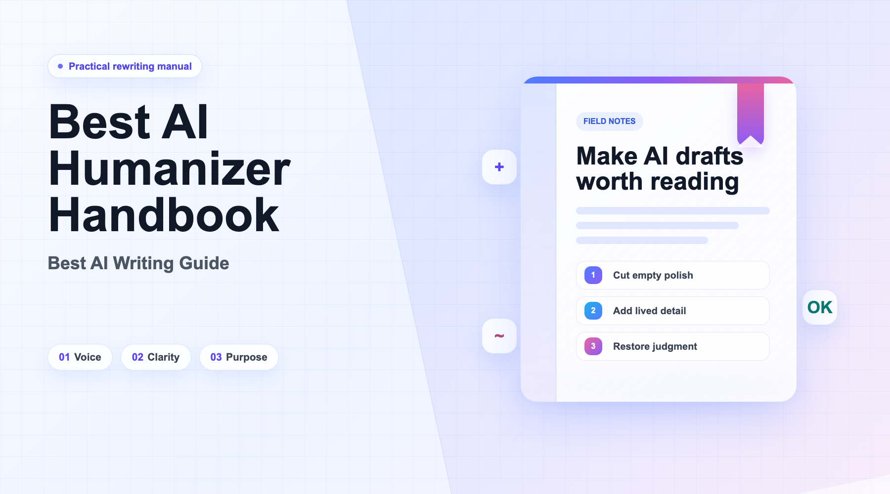

# **Introduction**  

### Why should we Humanize?  

By 2026, the market for AI text humanization is expected to explode from a niche tool into a whopping $100 billion industry supporting writers\. Right now, the leaders are Undetectable AI with 23 million users, Phrasly boasting over 3 million writers from 180\+ countries, and Lynote, which helps humanize more than 10 million words each year\. Originality\.ai is being used by major players like Duke, Harvard, Purdue, and Boston universities\. 

A survey by Scribbr of the top 100 universities in the US revealed that 78% don’t have clear or have relaxed rules around AI writing tools\. Still, raw outputs from ChatGPT are plagued by significant issues: imprecise language, awkward style, logical missteps, repetition, strange errors, grammar mistakes, and a lack of originality\. 

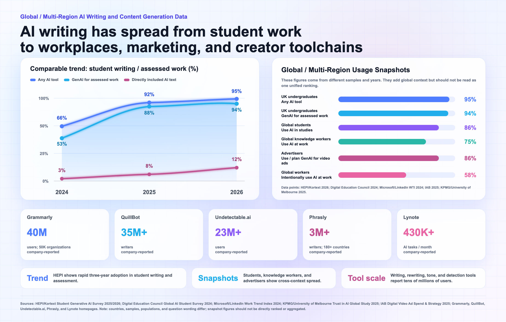

So, humanizing AI text isn’t just a nice\-to\-have anymore; it’s crucial for students, researchers, and creators to avoid detection, gain credibility, and maintain their unique voice while leveraging the speed of AI\. By 2026, getting good at this will be essential for boosting content productivity\.

### **What does this handbook do?**

✅ Quickly choose best AI Humanize tools/skills\.

✅ Compare pricing, use cases, strengths, and risks\.

✅ Build a tool stack for new\-media content production\.

✅ Improve copy naturalness, brand voice, and reuse efficiency\.

✅ Avoid blind purchases and common tool pitfalls\.

✅ Create a practical workflow from rewriting to publishing\.

### **What does this handbook NOT do?**

❌ It doesn't treat "humanizing text" as just swapping out words or making sentences smoother\.

❌ It doesn't dive deep into fancy tech or trends\. 

❌ It's not just bypassing AI detection  

We also genuinely want to hear from you\. Share the problems, suggestions, examples, and improvements you discover as you use this handbook\. Your feedback will make it more practical, more specific, and more useful in real classrooms and study sessions\.

# Part I: Understanding AI Humanizer Text

## **Chapter 1 \| What Is AI Humanized Text?**  

### 1\.1 From “sounding human” to showing real thinking  

Humanizing text isn’t just about making it sound like a person wrote it\. It’s more about adding real signs of thought — like pauses, opinions, emotional changes, and those little quirks that show someone has genuinely thought things through\. It’s not just about sounding fluent; it’s about having a good reason for each sentence, like a real person would\. This shift from ‘sounding human’ to ‘expressing genuine thought’ goes from just mimicking grammar to really capturing how we think\. The first approach might trick some detectors, but the second one makes your writing worthy of careful reading by another person\.

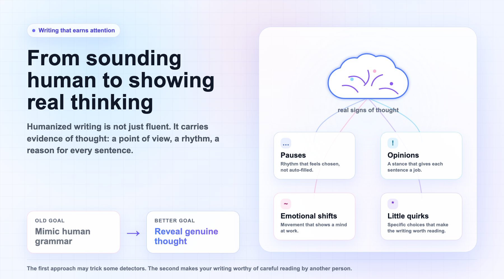

### 1\.2 Why AI\-generated text often feels mechanical  

AI text has no internal impulse to ‘want to say something’\. Instead, prediction drives each step \- shaped by patterns, not purpose\. A pause? Never happens\. Contradiction? Not found here\. Each phrase moves forward without doubt\. Mistakes do not appear\. Grammar stays flawless\. But that smoothness costs something\. The rough bits are gone\. Personal rhythm fades\. Even when accurate, nothing lands with urgency\. Correctness fills the page\. Yet no line carries weight because it must exist\.

### 1\.3 What AI can help with, and what it cannot do for you  

AI can help you put language in order instantly, correct grammar errors, write an essay that is exactly how you want it to be organized and much more\. Nor can it substitute for that leap of fucking behind the expressive habits that only real thinking engenders: an imperfect lexical dislocation, a speaking out after being made silent, a sentence somehow exploding forth because its grammar is wrong but it's still less than any actual object\. AI can provide you with all the "right words" but that "reason that simply had to be articulated," is a personal experience that will need you to articulate\.

## Chapter 2 \| Common Problems of AI Text and Human First Aid

The issues related to AI\-generated text are universal and have no connection whatsoever to the cost factor\. In case you wish to minimize the “AI flavor” manually and not employ any software, you might try the following tips\.

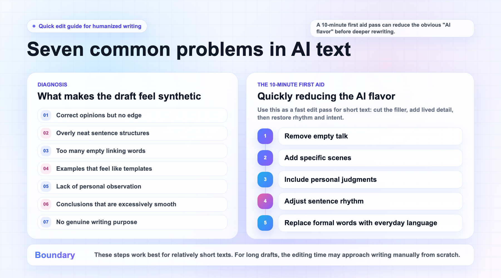

# **Part II: Best ****AI ****Humanizer Practices Guide**

Did you ever think that the AI Humanize product you are using is really meant for you? Ever paid a subscription fee, just for the product to be a complete miss — or worse, saw your friends pay less? More than a century of Humanize products are there for the users, right now\. Which makes for better value for money? So which one would suit you? If you pay close attention to this chapter, you'll avoid a lot of wasted detours\.

This chapter explores competing products from all over the world, conducts an in\-depth examination of their pricing, user experience and more, making it a practical guide to help you select the best product for your needs\. But before you jump in, we'd recommend pinning down what your own text writing needs are\.

## **Chapter 3 \| What AI Humanizer Products Are Free?**

### **3\.1 User\-Oriented Humanize Product Categories**

This manual categorizes existing products into six major types based on users’ needs in different usage scenarios\.

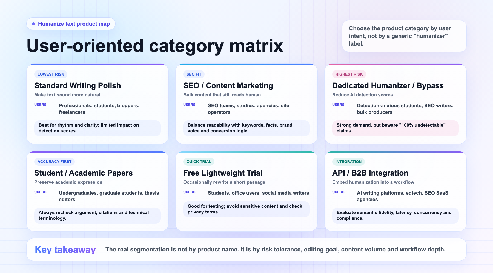

### **3\.2 Top 10 Best ****AI ****Humanizer Products**

If you are not satisfied with the product you are currently using, feel free to try the ten most cost\-effective products we have identified through comprehensive research\. **The rankings are in no particular order\.** You can make your choice based on your own writing needs\.

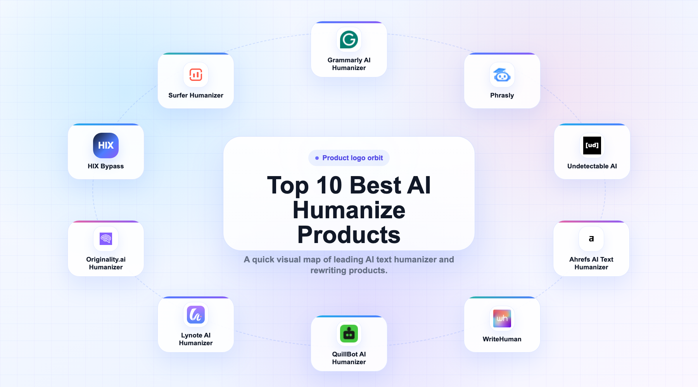

#### 1、Lynote AI Humanizer（[https://lynote\.ai/ai\-humanizer](https://lynote.ai/ai-humanizer%EF%BC%89)）

**Lynote AI Humanizer** is an “anti‑detection AI text humanization” tool from Lynote, specifically designed to rewrite text generated by major AI models such as ChatGPT, Claude, Gemini, and DeepSeek into natural writing that passes mainstream detectors including GPTZero, Copyleaks, Originality\.ai, Sapling, ZeroGPT, Grammarly, and Quillbot\.

- **10M\+ words humanized, 99% bypass rate**  

- **Multi‑language support**  

    - 80\+ languages – one of the broadest language coverages among such products  

    - Includes English, Spanish, French, German, Portuguese, Russian, Chinese, Japanese, Korean, and more  

- **How to use \(3 steps\)**  

    1. Paste or upload a file \(DOC / DOCX / PDF / TXT\) of AI text  

    2. Select rewriting mode: Balanced \(default\) / Simple / Standard / Enhanced \(4 levels, detailed below\)  

    3. Click the “Humanize” button → get the rewritten result in seconds  

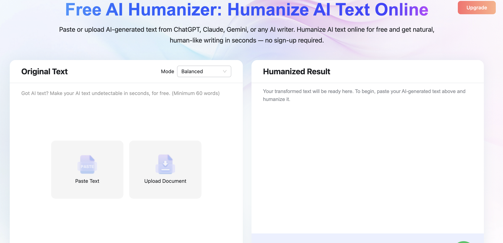

- **Version \& pricing**  

    - **Free** – 0 words \+ 600 words per request limit, no registration required  

    - **Sign Up** – after registration, unlock unlimited notebooks \+ sync  

- **7 official key selling points**  

    - **99% Undetectable Guarantee** – hard guarantee for anti‑detection  

    - **Context‑Aware Rewriting** – understands context \(distinct from basic synonym‑swapping tools\)  

    - **Customizable Bypass Modes** – 4 adjustable rewriting intensities  

    - **Plagiarism‑Free Output** – passes Copyscape and other plagiarism checkers  

    - **SEO‑Friendly Optimization** – preserves target SEO keywords \(optimized specifically for blog/SEO scenarios\)  

    - **80\+ Languages Supported** – multilingual support  

    - **No Sign‑Up Required** – basic usage without registration \(similar to Undetectable AI\)  

    - **Private \& Secure** – no storage, not used for training

#### 2、QuillBot AI Humanizer（https://quillbot\.com/）

**QuillBot AI Humanizer** is developed by QuillBot \(a Learneo, Inc\. company\) as an “AI‑era extension” of its core Paraphraser product suite\. It is specifically designed to rewrite text generated by major AI models such as ChatGPT, Gemini, Claude, DeepSeek, Copilot, and others into natural, human‑like, fluent writing\.

- **35\+ million users worldwide**  

- **Training data:** Fine‑tuned on tens of thousands of real human‑written texts  

- Uses a combination of “rules \+ models \+ a continuously updated blocklist of AI‑typical words/structures” to remove “AI tells” \(mechanical traces\) from AI text  

- **Multi‑language support:**  5 languages \+ 4 English dialects  

    - English \(4 dialects: US / UK / AU / CA\)  

    - Spanish  

    - French  

    - German  

    - Portuguese  

- **How to use \(3 steps\)**  

    1. Paste AI‑generated text \(from ChatGPT, Claude, Copilot, etc\.\)  

    2. Click the “Humanize” button  

    3. Get a humanized version in seconds; you can further fine‑tune by selecting alternative phrases on the right side  

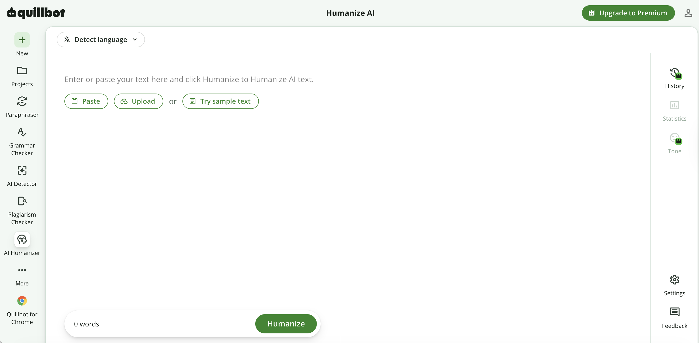

- **Pricing \& plans**  

- **Official key selling points**  

    - **Trained on tens of thousands of human texts** – fine‑tuned on real human writing  

    - **Best‑in‑class** – claims to be a leader in its category  

    - **Multi‑language** – 5 languages \+ 4 English dialects  

    - **Responsible writing** – emphasizes academic integrity and disclosure of AI use  

    - **Human Score real‑time feedback** – instantly measures human‑likeness after rewriting

#### 3、Grammarly AI Humanizer（https://www\.grammarly\.com/ai\-humanizer）

**Grammarly AI Humanizer** is an AI text rewriting tool under Grammarly, specifically designed to rewrite AI\-generated content from ChatGPT, Claude, Google Gemini, and other AI sources into more natural, human\-like writing, while preserving the core information of the original text\.

- **40\+ million users worldwide  **

- Officially reported: 95% of students consider Grammarly essential for their studies; 95% of users say Grammarly helps them maintain their own voice; 96% report feeling more confident writing with Grammarly; 90% believe Grammarly makes their writing more persuasive \(data from official website\)

- Use cases include Academic papers and research drafts, Reports and proposals, Marketing copy, Customer service emails, Blog \& social media\. You are not pitched on “spinning content” \(translating content to get around detection\) but instead as a tool that reduces stiffness, repetition, excessive formalism, and the stereotypical templated feel of AI\-writing text\.

- **Supports 6 languages:**

    - English

    - Spanish

    - French

    - German

    - Portuguese

    - Italian

**How to use \(3 steps\)**  

1. Paste text or upload a file into the input box at the top of the page  

2. Click the "Humanize" button  

3. Get natural, rewritten text in seconds  

Also supports file upload \(via the "Upload file" button\) and offers a "Try sample text" feature\.

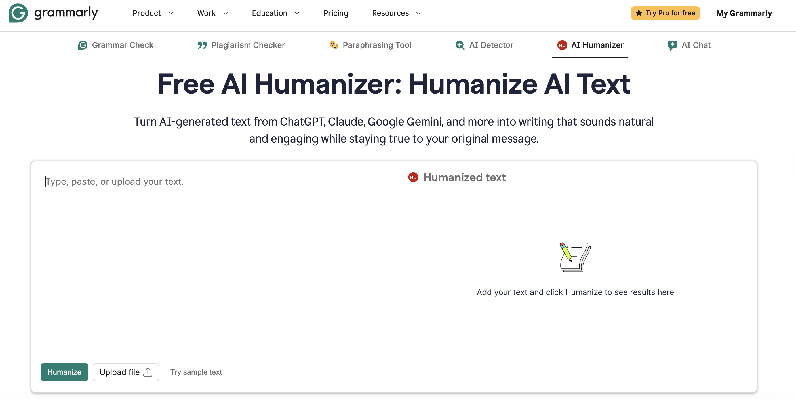

**Pricing \& Plans**

**Official Key Selling Points**  

- **Expertly Engineered** — Designed by a world\-class team of linguists and engineers  

- **Instant Humanization** — Output in seconds  

- **Constantly Improving** — Continuously iterated as AI writing patterns evolve  

- **Context Aware** — Understands purpose, tone, and audience to deliver output that aligns with your intent  

- **Trusted Ecosystem** — Seamlessly integrates with Grammarly's full suite of writing tools

#### 4、Surfer Humanizer（[https://surferseo\.com/ai\-humanizer/](https://surferseo.com/ai-humanizer/)）

**Surfer AI Humanizer** is a “free AI content humanization tool” within Surfer’s \(now part of Positive Group, headquartered in Wrocław, Poland\) AI Visibility Platform\. It is specifically designed to rewrite text generated by AI models such as ChatGPT, Claude, Gemini, Llama, Jasper, etc\., into natural, readable versions that can be detected as human‑written by detectors like Turnitin, Copyleaks, and GPTZero\. Essentially, it is a “traffic‑driving free tool” for the Surfer SEO platform\.

- **1\.5m\+ users worldwide**  

- **English only**  

- **How to use \(3 steps\)**  

    1. Paste AI text into the text box  

    2. Click the “Humanize” button  

    3. Get a rewritten version capable of “bypassing AI detectors” in seconds  

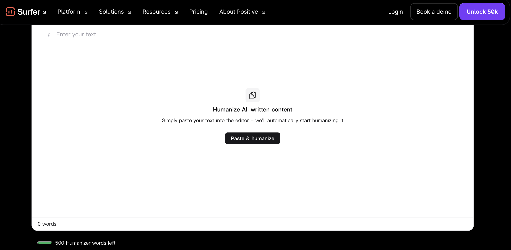

- **Pricing \& plans**  

    - Free vs\. paid quotas  

    - Unregistered users: max 500 words per request  

    - Registered users without a paid plan: max 1,000 words per request  

    - Paid subscribers \(Surfer Platform\): max 50,000 words per request \+ unlimited AI detection  

- **Official key selling points**  

    - **100% free trial with registration** – unlock basic features without payment  

    - **Bypass AI detectors** – explicitly supports Turnitin, Copyleaks, GPTZero  

    - **Plagiarism‑free** – 100% original, no risk of plagiarism  

    - **SEO optimized** – content remains compliant with Google ranking requirements after humanization  

    - **ChatGPT Humanizer** – specifically tuned for ChatGPT output  

    - **Multi‑language** – supports translation into multiple languages after rewriting \(input still requires English\)  

    - **Google friendly** – Google does not penalize AI content, but readers / schools / clients expect a “human touch”

#### 5、Originality\.ai Humanizer（[https://originality\.ai/ai\-humanizer](https://originality.ai/ai-humanizer%EF%BC%89)[）](https://originality.ai/ai-humanizer%EF%BC%89)

**Originality\.ai AI Humanizer \(“AI Bypasser”\)** is a “free AI text humanization” tool launched by Originality\.ai in 2026\. It is specifically designed to rewrite text generated by ChatGPT \(GPT‑5\.2, GPT‑5\.1\), Gemini 3, Grok 4\.1 Fast, Claude, Llama, and others into “human‑like” versions\. Essentially, it is the reverse tool of Originality\.ai’s AI Detector — able to both detect and rewrite — creating a rare “self‑check, self‑correct” within the industry\.

- **Language:** The humanizer primarily works with English\.

- **How to use \(3 steps\)**  

    1. **Paste / Upload / Enter URL / Use sample** \(4 input methods supported\)  

    2. **Select Tone** \(Standard / Academic / Professional / SEO/Blogs\), **Output Length**, **Rewrite Depth** \(Minimal → Maximize\)  

    3. Click **Humanize** → Get the rewritten result in seconds  

- **3 core customization dimensions officially promoted**  

    - **Tone:** 4 options – Standard, Academic, Professional, SEO/Blogs  

    - **Output Length:** adapts from short copy to long blog posts  

    - **Rewrite Depth:** from minimal \(preserves original wording\) to maximize \(heavy rewriting\)  

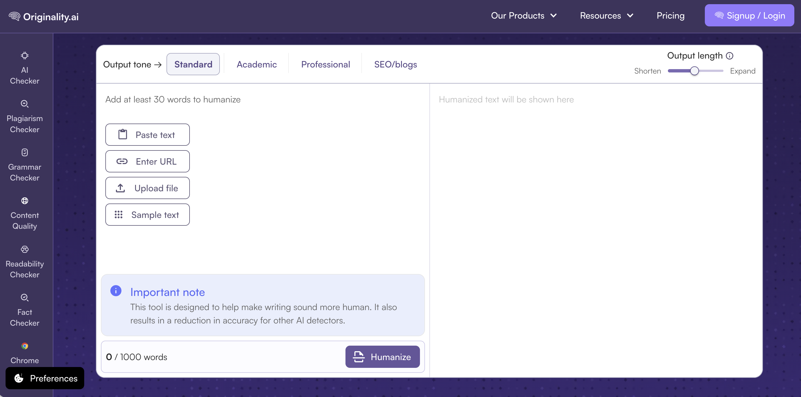

- **Pricing \& plans**  

    - **Free vs\. paid**  

    - **Basic Humanizer tool:** free to use \(1,000‑word limit\)  

    - **Full Suite** \(AI Detector \+ Plagiarism \+ Fact Checker \+ Readability \+ Grammar \+ Deep Scan\): paid subscription  

- **Official key selling points**  

    - **Smart humanization** – developed by the maker of the industry’s most accurate AI detector  

    - **Customize tone, depth, clarity** – fine‑grained control across three dimensions  

    - **Bypass most AI detectors** – explicitly positioned as a “detection bypass” tool \(less restrained than Grammarly\)  

    - **Industry‑leading accuracy\-** – their own AI Checker leads in independent tests  

    - **Free AI Humanizer** – the basic version is completely free  

    - **Responsible use** – official advice: “check your project / school / contract rules first” before using

#### 6、Phrasly（[https://p](https://phrasly.ai/ai-humanizer)[hrasly\.ai/ai\-humanizer](https://phrasly.ai/ai-humanizer)）

**Phrasly \(full brand name: Phrasly\.AI\)** is one of the leading products in the anti‑detection AI humanizer space in 2026, operated by a US‑based company\. It is specifically designed to rewrite text generated by major AI models such as ChatGPT, Claude, and Gemini into natural writing that passes mainstream detectors like Turnitin, GPTZero, and Originality\.ai\. It also offers complementary tools including an AI Writer, AI Detector, Thesis Generator, Translator, and Pages \(all‑in‑one editor\)\. Phrasly does **not** use GPT‑3 or GPT‑4 — while many competitors simply “wrap” OpenAI’s models \(which will break once OpenAI adds watermarks in the future\), Phrasly uses its own proprietary model trained on 1 million\+ pages of real human writing \(the homepage emphasizes “500K\+”\)\.

- **3m\+ writers worldwide**  

- **Multi‑language support**  

    - English  

    - Spanish  

    - French  

    - German  

    - Portuguese  

    - Chinese  

    - Russian  

    - Japanese  

    - Other languages  

- **How to use \(3 steps\)**  

    1. Paste AI text  

    2. Click “Humanize”  

    3. Get a rewritten version that bypasses detectors  

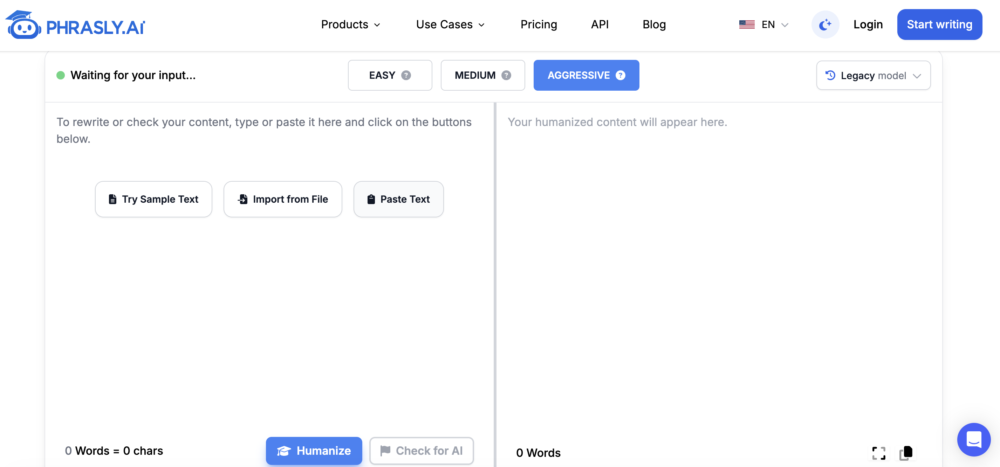

- **Pricing \& plans**  

- **Official key selling points**  

    - **Own proprietary AI** – self‑built model, not dependent on OpenAI  

    - **Trained on 1M\+ real human pages** – trained on authentic human writing  

    - **Watermark \& future proof** – unaffected by OpenAI watermarks  

    - **TurnItIn approved** – independently audited to pass TurnItIn  

    - **US‑based, data private** – US company, own servers, privacy controlled  

    - **99\.7% average human score** – based on tests on 100,000 documents  

    - **Ethical use** – officially emphasizes “improving writing quality,” not just “bypassing detection”

#### 7、WriteHuman（[ht](https://writehuman.ai/%EF%BC%89)[tps://writehuman\.ai/](https://writehuman.ai/%EF%BC%89)）

**WriteHuman** is the most “hardcore tech‑oriented” representative product in the anti‑detection AI humanizer space in 2026\. Its core positioning is an “AI text humanization tool specifically designed for major detectors such as GPTZero, Originality, Turnitin, ZeroGPT, Copyleaks, and Grammarly\.” It also offers an MCP \(Model Context Protocol\) Server and a REST API — making it the only one among the eight products that provides a native interface for AI agents\.  

**Latest update:** On June 1, 2026, the Enhanced Model was upgraded to specifically target GPTZero 4\.6b and Originality detectors\.

- **Multi‑language support**  

    - 40\+ languages  

    - Explicitly supports output from all major AI models including ChatGPT, Claude, Gemini, Grok, DeepSeek, etc\.  

- **How to use \(3 steps\)**  

    1. Copy AI text \(from any AI tool\)  

    2. Paste it into the WriteHuman rewriting box  

    3. Click “Write Human” → Get a version that “reads like a human wrote it” in seconds  

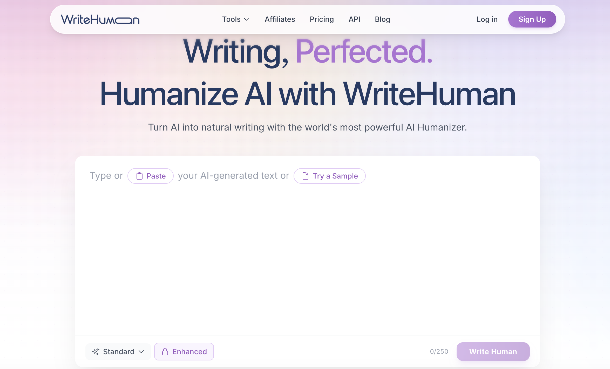

- **Pricing \& plans**  

- **Official key selling points**  

    - **Enhanced Model vs\. GPTZero 4\.6b / Originality** – The June 1 upgrade specifically targets these two detectors  

    - **40\+ languages** 

    - **Built‑in Content Scanner** – Self‑check with a 98% Natural Score  

    - **Multi‑variation output** – 1‑5 variants可选 for easy comparison  

    - **MCP \& API native** – The only one with a native interface for AI agents  

    - **Your voice, preserved** – Preserves original meaning, rhythm, and personal tone

#### 8、**Ahrefs AI Text Humanizer** （[https://ahrefs\.com/writing\-tools/ai\-humanizer](https://ahrefs.com/writing-tools/ai-humanizer)）

**Ahrefs AI Text Humanizer** is a free “AI text humanization” tool within Ahrefs’ \(a well‑known SEO tool provider headquartered in Singapore\) free AI Writing Tools suite\. It is specifically designed to rewrite AI‑generated text into natural, human‑like writing\. Essentially, it serves as an additional traffic‑driving tool within Ahrefs’ broader SEO product matrix, positioned as a “zero‑barrier, basic rewriting tool for English‑language scenarios\.”

- **21,545 users worldwide**  

- **English only**  

- **How to use \(extremely simple\)**  

    1. Paste the text you want to rewrite into the text box \(2,048‑character limit\)  

    2. Click the “Humanize Text” button  

    3. Get one rewritten variant in seconds \(“1 variant”\)  

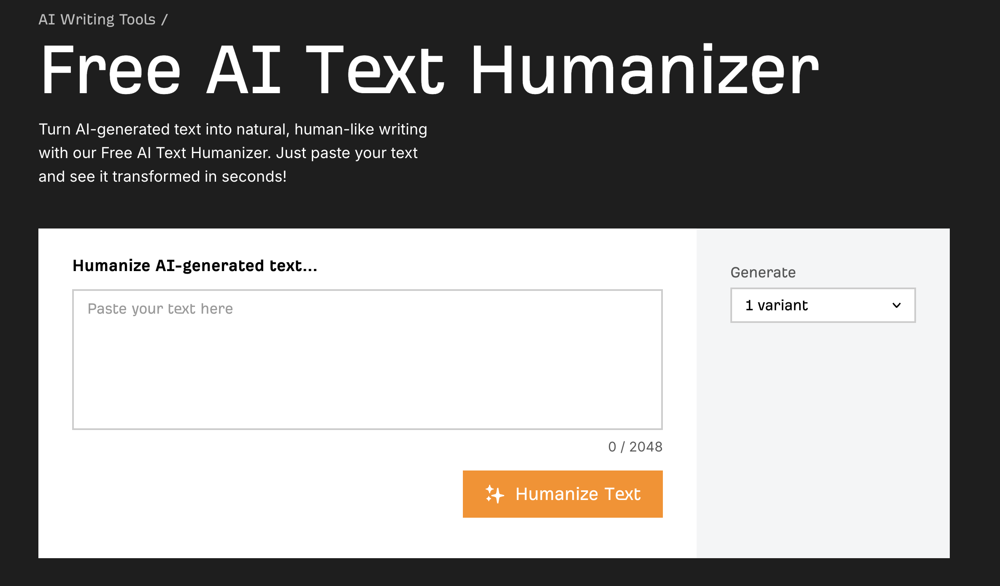

- **Official key selling points**  

    - **Free 100%** – completely free, no registration required  

    - **One‑click humanize** – minimalist operation, no distractions  

    - **Tight SEO tool chain** – with the same account, you can jump to Ahrefs AI Content Helper, Paraphrasing Tool, Plagiarism Checker, Grammar Checker, and more with one click  

    - **Suitable for multiple scenarios** – blog, social media, email marketing, academic writing, website copy – five major scenarios  

    - **Untitled by AI** – the rewritten result “doesn’t sound like AI”

#### 9、Undetectable AI（[https://undetectable\.ai/](https://undetectable.ai/)）

**Undetectable AI** \(full brand name: undetectable\.ai / Undetectable AI Detector \& Humanizer\) is the “pioneer \+ traffic leader” in the anti‑detection AI humanizer space\. It was the first to turn the “AI Bypasser” concept into a product and was named **\#1 Best AI Detector** by Forbes\. Its Humanizer works together with its own AI Detector to form a closed loop of “detect → rewrite → verify\.”

As of 2026, it has **23\+ million users** and has been featured in top‑tier media including Forbes, Business Insider, USA Today, Mashable, ABC, CBS, FOX, NBC, BBC, and Nature\.

- **Multi‑language support**  

    - **English** as the primary optimized language  

    - **50\+ languages** as secondary support \(including Simplified Chinese zh‑cn, Traditional Chinese zh‑tw, Japanese ja, Korean ko, Arabic ar, Russian ru, Hindi hi, Portuguese pt/pt\_br, Spanish es, French fr, German de, Italian it, etc\.\)  

- **How to use \(3 steps\)**  

    1. Paste AI text \(up to 10,000 characters\) — more generous than Phrasly’s 5,000 words/request  

    2. Select **Humanize Level**: Basic / Stealth / Undetectable \(3 intensity levels\)  

    3. Select **Use Case Preset**: General Writing / Essay / Article / Marketing Material / Story  

    4. Click “Humanize AI” → Get the rewritten result in seconds  

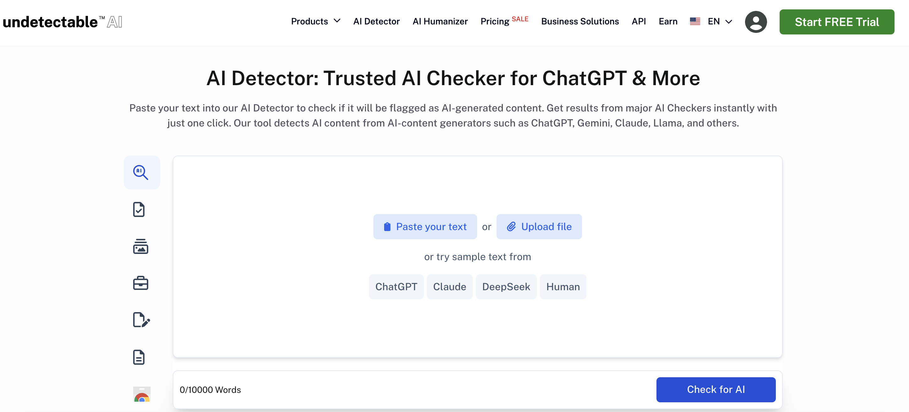

- **Money Back Guarantee \(exclusive selling point\):** If any AI detector flags the result as non‑human → full refund  

- **Pricing \& plans**  

- **Official key selling points**  

    - **Forbes \#1 Best AI Detector** – prestigious endorsement  

    - **99% accuracy** – validated by independent tests  

    - **100% human‑content scores** – target score after rewriting  

    - **Passes AI detectors** – explicitly positioned for anti‑detection  

    - **Satisfaction guaranteed** – refund if detected \(unique in the industry\)  

    - **Watermark and future proof** – immune to watermarks  

    - **Multi‑language support** – 50\+ languages  

    - **23M\+ users** – largest user base among the eight products  

    - **Starting at $5/month \(annual billing\)** – low price barrier  

    - **End‑to‑end workflow** – the most complete tool matrix

#### 10、HIX Bypass（https://hixbypass\.com/）

**HIX Bypass** \(also known as HIX AI Bypasser, HIX Humanizer\) is an AI detection bypasser product under HIX\.AI \(an AI writing tool company founded in Hong Kong, China, serving a global audience\)\. HIX\.AI’s core product matrix is the HIX AI Writer \(an all‑in‑one AI writing platform\), and HIX Bypass is the sub‑tool within it dedicated to “AI text humanization\.”

- **Multi‑language support**  

    - Supports 50\+ languages  

    - Includes English, Chinese \(Simplified/Traditional\), Spanish, French, German, Portuguese, and more  

- **How to use**  

    1. Paste AI text  

    2. Click “Bypass AI Detection”  

    3. Get a “human‑touch” version in seconds  

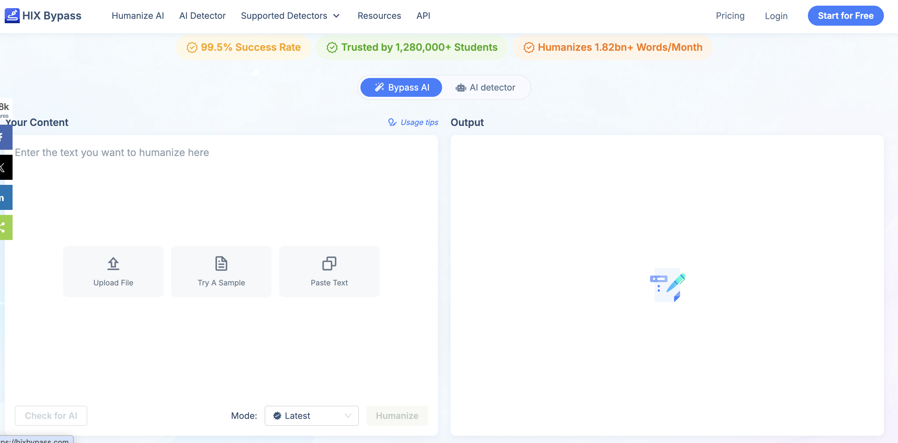

- **Pricing \& plans**  

- **Official key selling points**  

    - **Bypass all major AI detectors** – compatible with GPTZero, Originality\.ai, Turnitin, ZeroGPT, Copyleaks, Content at Scale, etc\.  

    - **Watermark‑free** – the rewritten result carries no AI watermarks  

    - **Multi‑language** – 50\+ languages  

    - **Built into HIX ecosystem** – integrated with HIX Writer, HIX Chat, HIX Editor

### **3\.3 Comparison of Mainstream  Free AI Humanizer Products**

Regarding the issues that users care about, such as price and product drawbacks, we compared 10 popular products worldwide across nearly 10 dimensions using information from their official websites\. The compiled results are as follows:

Additionally, we dive deep into the features of the products and recommend the best products to our readers for different scenarios\.

### 3\.4 Other products

# Part III\. AI Humanizer Practical examples

## **Chapter 4 \| Best ****AI Humanize****r**** ****tools by use case segment**

### 4\.1 Best Free SEO Humanizer Text Tools

It is also good for SEO if humanizing the text makes it more specific, credible and clearer while preserving all relevant keywords and facts\.

SEO Humanize does not entail "faking" AI text to appear as though it was authored by humans\. It takes  more easily readable, emotionless writing and converts it into content that is interesting for the user as well as convenient to digest for search engines\. Does it pass all four tests: retaining keywords and entities, having added realistic and believable information, improves readability and original sentence structure?

**Checklist:**Remove templated jargonDo introduce real life examples, testimonialsDisconnect KeywordsLeave your facts and referencesIntegrate your brand tone moreClarify paragraphs and cut the clutter

**Don'ts:** Be too out of focus with accuracy just to get through a detector, copy paste keywords in bulk, prepare fake experiences just to fill up the text and ruin quality content only for getting a tool that gets bypassed by whatever platform or the school uses\.

From an SEO point of view: Google has said on many occasions that no matter what way you use to produce content, the best quality content will be shown in the highest position on the searches\.The real concern is the bad quality content that has been created in bulk using automation\.

##### **Choose by Job, Not by Ranking**

|**Your job**|**Start with**|**Why**|
|---|---|---|
|Short English blog or product\-page snippets|Lynote, Ahrefs, Surfer|They sit closest to SEO workflows and are good for local copy cleanup\.|
|Brand voice and professional polish|Grammarly |Useful when the final copy must sound consistent and publishable\.|
|Controllable sentence\-level rewriting|QuillBot|Best when a human editor wants to review changes as they go\.|
|Pre\-publication quality checks|Originality\.ai |SEO/Blogs tone, rewrite depth, fact/readability/checker tools make it useful for QA\.|
|Multilingual short content|Lynote, Humanize\.io, AIHumanizer\.ai|Language coverage is broad, but localization and keyword retention still need review\.|
|Very low\-budget trials|BypassAI\.io|Friendly free entry, but limits and claims need verification\.|
|Bulk/API/paid upgrade path|HIX Bypass, Undetectable AI, Originality\.ai|Free access is not the main value; evaluate them as procurement candidates\.|

##### **A Practical SEO Humanizer Workflow**

This workflow is more reliable than pasting an entire article into a humanizer\. Treat the tool as an editing assistant, not the final author\.

1. Define search intent first: informational, commercial investigation, transactional, or navigational\. Put that intent at the top of your working document\.

2. List protected elements: primary keyword, secondary keywords, brand names, product names, prices, data points, citations, internal links, and CTA\.

3. Process in blocks: rewrite by H2/H3 section or 150\-300 word chunks to avoid logic drift\.

4. Add human evidence: real observations, comparison judgments, screenshots, failure cases, reader objections, and practical next steps\.

5. Run SEO QA: Does the intro answer the query? Are keywords natural? Are entities and related terms present?

6. Run credibility QA: verify facts, dates, prices, limits, citations, and external links\. Do not keep invented details\.

7. Do the final human read: remove generic lines, tighten empty phrases, vary sentence rhythm, and make every paragraph earn its space\.

|**Recommended stacks** Short English SEO copy: Lynote、Ahrefs or Surfer \-\> Grammarly \-\> manual SEO QA\.  Long\-form publishing: add Originality\.ai or Surfer for a second QA pass\.  Multilingual content: test Lynote, Humanize\.io, AIHumanizer\.ai, or Undetectable AI, then use a native or localization editor\.|
|---|

##### **Pre\-Publication Checklist**

|**Check**|**Question**|
|---|---|
|Search intent|Does the first 100 words answer the question that brought the reader to the page?|
|Keywords|Does the primary keyword appear naturally in title/H1/intro/at least one H2 without stuffing?|
|Entities|Did the tool preserve brands, products, people, places, tools, and technical terms?|
|Experience|Does the page include first\-hand observations, constraints, examples, or practical advice?|
|Readability|Did you remove stock phrases, split long sentences, and make paragraphs easy to scan?|
|Credibility|Did you verify prices, dates, feature limits, data, citations, and links?|
|Differentiation|Does the page add judgment, steps, or examples beyond generic SERP summaries?|
|Conversion|Is the CTA natural, useful, and aligned with the reader's next step?|

|**Reusable Rewrite Prompt** Rewrite the SEO draft below so it sounds more natural, specific, and editor\-written\. Keep the primary keyword, entities, prices, data points, citations, and internal links unchanged\. Do not add unverified facts\. Remove generic AI phrasing\. Vary sentence length\. Add clearer transitions or subheads where useful\. After the rewrite, include a change summary and a list of facts that still need human verification\.|
|---|

### 4\.2 Best free bypass tools

This chapter analyzes "bypass tools" from the perspective of natural writing, avoiding false alarms and the practical applicability of the products\. We in no way want to teach cheating or circumventing school rules\. Our goal is to help students write their thoughts, quotes and revisions clearly and clearly\. We do not want detection tools to become "absolute judges"\. Against this background, we have compiled the most current data and feedback from users \(as of June 2026\) to explain the most common advantages and disadvantages of common "avoidance tools"\.

##### **User Reviews List**

Since one product cannot meet the needs of all users, we also combined products by usage scenarios, so that users can accurately identify the product combination that suits their needs\.

##### **Recommended Stacks**

### 4\.3 Best Social Media Management  Humanizer Tools

**Humanizing in Social Media Management Is More Than Just "Making AI Copy Sound Natural"**

It also includes: consistent brand voice, platform\-specific tone adaptation, trending topic response, human touch in comments and DMs, content repurposing, visual consistency, and post\-publish data feedback\.

##### **Best Humanizer Social Media Tool Matrix**

##### **Recommended Tool Stack**

##### **A Practical Humanize Workflow for Social Media**

1. **Define your platforms first** — The pacing and expression style for WeChat Official Accounts, Xiaohongshu, Weibo, LinkedIn, X \(Twitter\), TikTok, and YouTube Shorts are completely different\. Do not post the same content across all platforms\.

2. **Lock in your brand voice** — Create a list of brand keywords, banned words, common sentence patterns, things you never say, how you address your audience, and your CTA style\.

3. **Humanize the copy first** — Use tools like Lynote / Grammarly / QuillBot to remove AI jargon, translationese, and templated phrases\.

4. **Rewrite per platform** — Take the same core topic and break it into: headlines, long\-form articles, short posts, captions, comment replies, DM replies, and short\-video scripts\.

5. **Align visual assets** — Use Canva or Predis to generate covers, supporting images, and short\-video storyboards\. Ensure copy and visuals match\.

6. **Schedule and publish** — Use Buffer, Hootsuite, or Sprout Social to manage timing, approvals, and cross\-platform versions\.

7. **Review and optimize** — Track clicks, saves, comments, shares, completion rates, conversions, and negative feedback\. Feed the data back into your headline and topic bank\.

8. **Pre\-publish QA** — Check facts, pricing, links, copyright, ad claims, platform\-specific sensitive words, AI\-generated content disclosure, and brand compliance\.

# Part IV:  AI Humanizer Skill Best Practice Guide 

## **Chapter 5 \| What AI Humanizer skills Are Available?**

### 5\.1  Why we use AI Humanizer Skill

If the previous chapter compared the product to eating out at a restaurant, then this chapter teaches you how to build your own kitchen — both will fill you up, it just depends which one you prefer\. The Humanizer skill — essentially a list of text rules spanning hundreds or thousands of lines \(you can also think of it as a "plugin"\) — can be installed on your local computer and used together with AI chat software like Codex or Claude Code\. You copy and paste a piece of AI\-generated text, type a single command, and within seconds you get a more natural, human\-sounding version\. Unlimited use, no registration, no subscription \(at most it consumes a bit of your tokens\)\. The output is basically the same as what you'd get from paid websites\.

What we're talking about here is mainly the skill **totally free** found on GitHub, designed specifically to rewrite AI\-generated text so it sounds human\-written\.

All you need to do is** copy and paste **the instructions to use it\.

- Before using the Humanizer skill, be clear about its limitations:

    ❌ It cannot create a draft from scratch — you need to have a first draft to begin with\.

    ❌ It cannot guarantee 100% evasion of all AI detectors — it only lowers the probability\.

    ❌ It cannot write new content for you — it is a "rewriting tool," not a "writing tool\."

    ❌ It cannot guarantee accuracy after rewriting — it may occasionally alter facts, so you must read through the result\.

    ❌ Academic integrity is your own responsibility — using the tool to bypass school plagiarism checks means you bear the consequences; the tool does not vouch for you\.

- Since there's a free option, when should you consider paying?

    ✅ You use the skill to rewrite an article over and over, but it still fails AI detection\.

    ✅ You don't want to deal with any commands at all — you just want to open a webpage and click a button\.

    ✅ You need to rewrite dozens of articles in bulk and can't be bothered to paste each one manually\.

    ❌ None of the above applies? → Then don't spend any money\.

### 5\.2  AI Humanizer Skill classification

Based on the usage scenarios, we classify humanized tools as follows:

|**User Scenario**|**Count**|**Typical Users**|**Primary Priority**|**Repositories to Check First**|**Selection Note**|
|---|---|---|---|---|---|
|Chinese Content and Long\-form Writing|17|WeChat articles, blogs, reviews, product analysis, book chapters|Chinese prose quality, less translationese, factual preservation|op7418/Humanizer\-zh, MrGeDiao/shuorenhua, OUBIGFA/De\-AI\-Prompt\-Enhancer\-Writer\-Booster\-SKILL|Start with Chinese\-specific repositories\.|
|Academic / Research Writing|10|Papers, MBA theses, medical manuscripts, research drafts|Terminology protection, factual fidelity, reviewer\-appropriate style|redbaronyyyyy\-eng/humanizer\-zh\-academic, matsuikentaro1/humanizer\_academic, crabin/paper\-humanizer\-skill|Do not optimize primarily for detector evasion\.|
|Multilingual Localization|19|Russian, German, Korean, Finnish, Malay, Swedish, Portuguese, Japanese, etc\.|Local idiom, grammar, and language\-specific AI tells|ilyautov/humanizer\-ru, smixs/humanizer\-ru, Vladimir\-Human/humanizer\-ru|Choose by language rather than using a generic tool\.|
|General Writers|1|Articles, emails, explainers, draft polishing|Less formulaic language and stronger rhythm|theclaymethod/unslop|Check rule transparency and output controllability\.|
|Developer / CLI Workflows|18|Code comments, commits, README files, batch CLI workflows|Local execution, scriptability, low dependency footprint|blader/humanizer, conorbronsdon/avoid\-ai\-writing, Hainrixz/humanizalo|Prefer CLI and multi\-agent support\.|
|Marketing / SEO / Sales Copy|2|Landing pages, sales pages, SEO, cold email|Brand voice, keyword preservation, claim verification|forint573/miAI\-Humanizer\-Skill\-Awesome, thoughtful\-reservation690/humanise\-text\-skill|Avoid inventing performance claims or data\.|
|Personal Voice / Brand Consistency|1|Personal blogs, founder notes, team style|Voice profiles, brand terms, tonal consistency|brandonwise/humanizer|Requires sample text for calibration\.|
|Detection Review and Compliance|1|Editorial review, risk checks, content QA|Explainable scoring, evidence quotes, risk notes|chukant20\-cyber/Chuksbooks\-Humaniser\-tool|Detector results should be advisory only\.|

More specifically we have prepared a list of recommended use cases:

#### **1、Chinese Content and Long\-form Writing**

|**Repository**|**Stars**|**Best Fit**|**Link**|
|---|---|---|---|
|op7418/Humanizer\-zh|9619|A Chinese\-localized version of Humanizer for Claude Code Skills, designed to remove AI\-generated traces from t|[op7418/Humanizer\-zh](https://github.com/op7418/Humanizer-zh)|
|MrGeDiao/shuorenhua|389|A chinese / simplified chinese skill or tool candidate for chinese content and long\-form writing, based on the|[MrGeDiao/shuorenhua](https://github.com/MrGeDiao/shuorenhua)|
|OUBIGFA/De\-AI\-Prompt\-Enhancer\-Writer\-Booster\-SKILL|383|A de\-AI\-writing prompt and writer enhancement skill\.|[OUBIGFA/De\-AI\-Prompt\-Enhancer\-Writer\-Booster\-SKILL](https://github.com/OUBIGFA/De-AI-Prompt-Enhancer-Writer-Booster-SKILL)|
|devswha/patina|155|Detects and rewrites AI writing patterns in Korean, English, Chinese, and Japanese\. Runs as a skill for Claude|[devswha/patina](https://github.com/devswha/patina)|
|LifelongLazyLearner/qu\-ai\-wei|81|A Simplified Chinese humanizer skill for removing AI writing traces\.|[LifelongLazyLearner/qu\-ai\-wei](https://github.com/LifelongLazyLearner/qu-ai-wei)|
|shyuan/writing\-humanizer|15|A Claude Code plugin for removing AI writing traces and making Traditional Chinese text more natural\.|[shyuan/writing\-humanizer](https://github.com/shyuan/writing-humanizer)|
|ai\-zixun/humanizer\-zh|13|A Chinese de\-AI\-writing skill compatible with Codex, Claude Code, and OpenClaw for blogs, reviews, product ana|[ai\-zixun/humanizer\-zh](https://github.com/ai-zixun/humanizer-zh)|
|yelban/humanizer\.TW|10|Claude Code skill that removes signs of AI\-generated writing from text|[yelban/humanizer\.TW](https://github.com/yelban/humanizer.TW)|

#### **2、Academic / Research Writing**

|**Repository**|**Stars**|**Best Fit**|**Link**|
|---|---|---|---|
|redbaronyyyyy\-eng/humanizer\-zh\-academic|175|A Claude Code Skill for reducing AIGC detection risk in Chinese academic writing\.|[redbaronyyyyy\-eng/humanizer\-zh\-academic](https://github.com/redbaronyyyyy-eng/humanizer-zh-academic)|
|matsuikentaro1/humanizer\_academic|98|A Claude Code skill that removes signs of AI\-generated writing from academic medical papers, making them sound|[matsuikentaro1/humanizer\_academic](https://github.com/matsuikentaro1/humanizer_academic)|
|crabin/paper\-humanizer\-skill|89|A Chinese\-English academic polishing and humanization skill that removes AI\-generated traces while preserving |[crabin/paper\-humanizer\-skill](https://github.com/crabin/paper-humanizer-skill)|
|cangtianhuang/humanizer\-academic\-zh|39|A lightweight Chinese academic humanizer for Claude Code Skills and system prompts; fast, token\-efficient, and|[cangtianhuang/humanizer\-academic\-zh](https://github.com/cangtianhuang/humanizer-academic-zh)|
|harshaneel/humanize|24|Best static AI text humanizer\. Two research\-grounded skills that work in any LLM \(Claude, ChatGPT, Gemini, Cod|[harshaneel/humanize](https://github.com/harshaneel/humanize)|
|stephenlzc/humanize\-mba\-text\-skill|24|A Chinese MBA thesis tool for detecting and removing AI writing patterns\.|[stephenlzc/humanize\-mba\-text\-skill](https://github.com/stephenlzc/humanize-mba-text-skill)|
|gabelul/slopbuster|16|AI text humanizer for prose, code \& academic writing\. 100\+ patterns, two\-pass audit, three\-tier scoring, voice|[gabelul/slopbuster](https://github.com/gabelul/slopbuster)|
|momo2young/humanize\-academic\-writing|14|A Cursor/Claude AI skill that transforms AI\-generated academic text into natural scholarly writing\.|[momo2young/humanize\-academic\-writing](https://github.com/momo2young/humanize-academic-writing)|

#### **3、Multilingual Localization**

|**Repository**|**Stars**|**Best Fit**|**Link**|
|---|---|---|---|
|ilyautov/humanizer\-ru|65|A Claude skill for Russian text that removes 52 neural\-network writing markers, including bureaucratic style, |[ilyautov/humanizer\-ru](https://github.com/ilyautov/humanizer-ru)|
|smixs/humanizer\-ru|63|A russian skill or tool candidate for multilingual localization, based on the repository name, topics, and ava|[smixs/humanizer\-ru](https://github.com/smixs/humanizer-ru)|
|Vladimir\-Human/humanizer\-ru|46|A Russian AI\-agent skill that removes 29 machine\-generation markers from text\.|[Vladimir\-Human/humanizer\-ru](https://github.com/Vladimir-Human/humanizer-ru)|
|apurvrdx1/tagore|42|Make AI\-generated prose sound human\. 29\-pattern catalog \+ 8\-rule operating system \+ 8\-dimension scoring rubric|[apurvrdx1/tagore](https://github.com/apurvrdx1/tagore)|
|marmbiz/humanizer\-de|33|A German Humanizer version that detects and removes AI writing patterns across 57 patterns in 10 categories; i|[marmbiz/humanizer\-de](https://github.com/marmbiz/humanizer-de)|
|abualif120/manusiawi|27|Claude skill that strips AI writing patterns from Malaysian BM text\. 32 BM patterns \+ Indonesian intrusion det|[abualif120/manusiawi](https://github.com/abualif120/manusiawi)|
|Hakku/finnish\-humanizer|17|27 patterns that make AI\-generated Finnish sound human|[Hakku/finnish\-humanizer](https://github.com/Hakku/finnish-humanizer)|
|SergeNS\-mne/humanizer\-ru|12|A russian skill or tool candidate for multilingual localization, based on the repository name, topics, and ava|[SergeNS\-mne/humanizer\-ru](https://github.com/SergeNS-mne/humanizer-ru)|

#### **4、General Writers**

|**Repository**|**Stars**|**Best Fit**|**Link**|
|---|---|---|---|
|theclaymethod/unslop|25|An agent skill to de\-AI your writing|[theclaymethod/unslop](https://github.com/theclaymethod/unslop)|

#### **5、Developer / CLI Workflows**

|**Repository**|**Stars**|**Best Fit**|**Link**|
|---|---|---|---|
|blader/humanizer|22918|Claude Code skill that removes signs of AI\-generated writing from text|[blader/humanizer](https://github.com/blader/humanizer)|
|conorbronsdon/avoid\-ai\-writing|1735|Skill that audits and rewrites content to remove AI writing patterns\. Use it with your favorite agents includi|[conorbronsdon/avoid\-ai\-writing](https://github.com/conorbronsdon/avoid-ai-writing)|
|Hainrixz/humanizalo|71|Claude Code skill that detects 40 AI writing patterns and rewrites text to sound human\. Self\-auditing loop\. Bi|[Hainrixz/humanizalo](https://github.com/Hainrixz/humanizalo)|
|Aboudjem/humanizer\-skill|70|AI writing pattern detector and rewriter\. 43 patterns, 5 voices, 0\-100 AI\-tell score\. Pure Markdown, zero depe|[Aboudjem/humanizer\-skill](https://github.com/Aboudjem/humanizer-skill)|
|jpeggdev/humanize\-writing|24|Claude Code skill that rewrites AI\-generated content to sound human|[jpeggdev/humanize\-writing](https://github.com/jpeggdev/humanize-writing)|
|diaiq/claude\-skill\-humanizer|4|Free Claude Code skill to humanize AI\-generated text\. Bypass GPTZero, Turnitin, and other AI detectors\. Powere|[diaiq/claude\-skill\-humanizer](https://github.com/diaiq/claude-skill-humanizer)|
|itsjwill/humanizer\-x|4|4\-pass AI text humanizer \+ voice agent humanization engine\. 30 severity\-ranked patterns, statistical fingerpri|[itsjwill/humanizer\-x](https://github.com/itsjwill/humanizer-x)|
|apoapostolov/humanizer|3|Humanizer is an AI writing skill that detects and rewrites common signs of AI\-generated prose\. It helps agents|[apoapostolov/humanizer](https://github.com/apoapostolov/humanizer)|

#### **6、Marketing / SEO / Sales Copy**

|**Repository**|**Stars**|**Best Fit**|**Link**|
|---|---|---|---|
|forint573/miAI\-Humanizer\-Skill\-Awesome|0|A Claude Agent Skill that humanizes AI\-written marketing and long\-form copy: landing pages, sales pages, e\-boo|[forint573/miAI\-Humanizer\-Skill\-Awesome](https://github.com/forint573/miAI-Humanizer-Skill-Awesome)|
|thoughtful\-reservation690/humanise\-text\-skill|0|Humanise AI text for Claude Code and remove AI\-like patterns with one command|[thoughtful\-reservation690/humanise\-text\-skill](https://github.com/thoughtful-reservation690/humanise-text-skill)|

#### **7、Personal Voice / Brand Consistency**

|**Repository**|**Stars**|**Best Fit**|**Link**|
|---|---|---|---|
|brandonwise/humanizer|88|OpenClaw skill that detects and removes signs of AI\-generated writing, making text sound natural and human\. |[brandonwise/humanizer](https://github.com/brandonwise/humanizer)|

#### **8、Detection Review and Compliance**

|**Repository**|**Stars**|**Best Fit**|**Link**|
|---|---|---|---|
|chukant20\-cyber/Chuksbooks\-Humaniser\-tool|3|ChatGPT, Claude, and any other AI skill for rewriting AI\-generated text into natural human writing and bypassi|[chukant20\-cyber/Chuksbooks\-Humaniser\-tool](https://github.com/chukant20-cyber/Chuksbooks-Humaniser-tool)|

### 5\.3  Best AI Humanizer Skill

#### 1、Humanizer（https://github\.com/blader/humanizer）

Humanizer is not trying to be another AI writing model\. Its real value is that it turns the vague idea of “this sounds AI\-generated” into a clear editing system\.

Most people can feel when a paragraph has AI flavor, but it is hard to say exactly why\. humanizer breaks that feeling down into specific patterns: generic openings, inflated claims, over\-polished wording, repetitive sentence structure, empty transitions, marketing\-style adjectives, aHnd conclusions that sound too neat\.

Then it gives Claude Code or OpenCode a practical rulebook for fixing those problems\. Instead of simply saying “make this sound human,” it tells the editor what to look for, what to avoid, and how to rewrite while keeping the original meaning\.

So the project is useful because it makes AI text editing more consistent\. It is not just a prompt that asks for better writing\. It is a reusable skill that defines what “AI\-sounding” means, turns that into concrete rewrite rules, and packages the whole process into a tool you can call directly inside your coding workflow\.

#### 2、humanize\-skill（https://github\.com/fendouai/humanize\-skill）

Humanize\-skill is an agent\-native editorial workflow for Codex, Claude Code, and OpenCode\-style agents\. It does not ship a rewriting CLI or a detector\-bypass trick\. The host model does the semantic edit; the skill supplies the quality contract, voice calibration rules, AI\-pattern diagnosis, specificity pass, and fact\-checking obligations\.Use it when a draft needs to become clearer, more specific, more faithful to the author, and safer to publish\.

The public promise is five\-part:

- Quality\-first humanization: make the draft clearer, more specific, and more credible instead of chasing detector scores\.

- Deep voice matching: use real samples to match the author's rhythm, stance, reasoning style, and expression habits\.

- Five\-layer AI\-pattern diagnosis: diagnose lexical, phrasal, syntactic, structural, and cognitive AI\-looking patterns\.

- Specificity and reasoning pass: turn empty generalities into text with numbers, context, reasons, limits, and visible trade\-offs\.

- Fact\-aware rewriting: support, weaken, flag, or remove factual claims, especially in product, research, health, and technical writing\.

#### 3、Humanizer\-zh（https://github\.com/op7418/Humanizer\-zh）

Humanizer\-zh is a tool for removing AI\-generated traces from text, helping you rewrite AI\-generated content to make it sound more natural and human\-written\.

This project is suitable for:

Editing and reviewing AI\-generated content

Improving the human touch in writing

Learning to recognize common patterns in AI writing

#### 4、stop\-slop（https://github\.com/hardikpandya/stop\-slop）

A skill for removing AI tells from prose\. AI writing has patterns\. Predictable phrases, structures, rhythms\. This skill teaches Claude \(or any LLM\) to catch and remove them\. 

#### 5、[humanize\-text](https://github.com/lynote-ai/humanize-text)\(https://github\.com/lynote\-ai/humanize\-text\)

Free open\-source AI text humanizer to convert AI\-generated content into undetectable, human\-like writing\. Bypass Turnitin, GPTZero, and all major AI detectors\. No sign\-up required\. Try our unlimited free online tool\.

# Q\&A

## **A\. Basic Concepts**

**Q1: What does "Humanize Text" actually mean?**  

A: It's not simply swapping a few synonyms in an AI text, nor just making sentences "smoother\." It is transforming an AI draft into an expression that more closely resembles real human thinking: with a clear stance, specific context, natural rhythm, genuine trade‑offs, and verifiable facts\.

**Q2: Does Humanize Text equal bypassing AI detection?**  

A: No\. Bypassing focuses only on machine scores; Humanize focuses on the reader, the author's voice, and content credibility\. Detectors are just one external risk and should not be the sole goal of writing\.

**Q3: Why does AI text often feel mechanical?**  

A: Common reasons include overly polished viewpoints, too‑even sentence structures, hollow transition words, templated examples, lack of personal observation, conclusions without edge, and no real purpose for writing\.

**Q4: What is the most core criterion for Humanize?**  

A: After revision, the text should be more specific, more credible, show more authorial judgment, and be easier for the reader to absorb – while not damaging facts, citations, terminology, keywords, or original meaning\.

**Q5: What is the difference between Humanize and copyediting?**  

A: Copyediting usually focuses on grammar, fluency, and wording\. Humanize additionally focuses on traces of thinking, expressive rhythm, scenario details, personal voice, and the removal of AI‑template feel\.

**Q6: What is the difference between Humanize and paraphrasing?**  

A: Paraphrasing is more like "saying it in another way"; Humanize is "reconstructing the intent to express\." It goes beyond rewording – it deals with empty speech, rhythm, tone, examples, judgment, and credibility\.

**Q7: Does Humanize make text unprofessional?**  

A: No, provided you choose the appropriate register\. Academic text can be more natural yet still rigorous; business copy can be warmer without being exaggerated; student assignments can sound more like themselves without being sloppy\.

**Q8: Can Humanize write an article from scratch?**  

A: Not recommended to define it that way\. Humanize is rewriting and editing, not creating real‑life experience out of thin air\. You need to at least provide a draft, opinions, sources, or a scenario\.

**Q9: What kind of text most needs Humanize?**  

A: AI first drafts, SEO drafts, product descriptions, student reflections, emails, speeches, blog posts, paper abstracts, long‑form social media posts, translation‑ese, and any text that is "correct but soulless\."

**Q10: What text is not suitable for direct Humanize?**  

A: Legal documents, medical advice, financial advice, formal citations, contract terms, exam answers, sensitive personal materials, unpublished papers, or confidential business information\. For such content, first confirm the rules, privacy, and professional review\.

---

## **B\. Writing Workflow**

**Q11: How can I reduce the AI‑feel in 10 minutes?**  

A: Delete empty speech; add specific context; insert personal judgment; adjust sentence rhythm by mixing long and short sentences; replace overly formal words with more natural expressions; finally check that facts haven't been damaged\.

**Q12: How to Humanize a long article?**  

A: Don't run a one‑click change on the whole piece\. Process it in chunks by heading or 150–300 words\. First list the facts, keywords, citations, and terminology that must be preserved, then rewrite each section, and finally unify tone and structure\.

**Q13: What should be prepared before Humanizing?**  

A: Prepare the original text, target audience, writing scenario, tone requirements, must‑preserve keywords/terms/citations/data, and parts that cannot be changed\.

**Q14: What must be manually checked after Humanizing?**  

A: Facts, numbers, citations, proper nouns, prices, dates, conclusions, links, policy requirements, course rules, and whether any fabricated content has been added\.

**Q15: How to tell if a paragraph still has an AI feel?**  

A: Look for being too even, too correct, lacking trade‑offs, lacking a concrete target, lacking a real scenario, or lacking a "must‑say" reason\.

**Q16: How to make text sound more human without becoming sloppy?**  

A: Don't deliberately add typos or grammatical errors\. Better methods: add specific observations, real constraints, clear judgments, natural transitions, and layered sentence rhythms\.

**Q17: Can Humanize reduce readability?**  

A: Yes, if you only pursue "human‑likeness" while ignoring clarity\. Good Humanize should improve both naturalness and readability – not make the text wordy, casual, or chaotic\.

**Q18: Should I keep the AI‑generated draft?**  

A: Yes, it is recommended\. Especially in learning, work, and publishing scenarios, keeping the original draft, revision history, sources, and manual editing process is important evidence for addressing disputes and reviewing quality\.

---

## **C\. Tool \& Product Selection**

**Q19: Are free tools sufficient?**  

A: For short texts, local paragraphs, lightweight SEO, ordinary emails, and social media content, they are usually enough\. For long texts, batch processing, API, team collaboration, privacy control, and stable quality, paid tools or local skills are generally needed\.

**Q20: When is it worth paying?**  

A: When you need batch processing, long‑text quotas, multilingual stability, API, team permissions, file upload, detection\+rewriting closed loop, revision history, or better customer support – then consider paying\.

**Q21: What scenarios is Lynote suitable for?**  

A: Low‑cost trial, multilingual short texts, SEO drafts, student/writing center trials, file upload processing\. Its strengths are free entry, no registration, 600 words, 80\+ languages, and keyword preservation\.

**Q22: What scenarios is Phrasly suitable for?**  

A: Student long papers, writing platform workflows, detection\+humanize closed loop, Pages editor, and all‑in‑one multi‑tool usage\.

**Q23: What scenarios is Undetectable AI suitable for?**  

A: As a benchmark tool for the detection\+rewriting closed loop, especially for comparing outputs from other humanizers\. But be aware of subscription, payment, and cancellation disputes\.

**Q24: What scenarios is WriteHuman suitable for?**  

A: Multilingual use, teams, API/MCP, multiple output variants, and those who want to integrate a humanizer into automated workflows\.

**Q25: Are Grammarly and QuillBot considered humanizers?**  

A: They are mild humanizers\. They emphasize clarity, grammar, readability, and responsible writing – not "hard bypassing detection\."

**Q26: Why are Ahrefs and Surfer suitable for SEO Humanize?**  

A: They sit within the SEO toolchain, suitable for blog paragraphs, product pages, headings and descriptions, website copy, and pre‑publishing optimization\. But SEO success still depends on content quality and search intent matching\.

**Q27: How to judge whether a humanize product is reliable?**  

A: Look at whether the free quota is clear, pricing and cancellation are transparent, original meaning is preserved, keyword/term protection is supported, privacy statements exist, independent user reviews are available, and whether it exaggerates "100% pass rates\."

**Q28: Why can't I trust only the official success rate?**  

A: Official success rates are product marketing, not independent tests\. Detectors, text types, languages, length, and rewriting approaches all affect results\.

**Q29: Why should I read negative reviews?**  

A: Negative reviews better expose purchase risks, such as refund difficulties, accidental annual charges, opaque quotas, distorted output, slow customer service, and vague privacy policies\.

---

## **D\. SEO \& Content Publishing**

**Q30: Will Google penalize AI content?**  

A: Google's official stance is that it focuses on content quality, not whether content is AI‑generated\. Using AI or automation to create helpful, original, people‑first content is not against guidelines\. The risk is using automation to mass‑produce low‑value content intended to manipulate rankings\.

**Q31: What is the goal of SEO Humanize?**  

A: Match search intent, preserve keywords and entities, add real experience and credible details, improve readability – not simply "wash" AI text to look human‑written\.

**Q32: What are the most common mistakes when Humanizing SEO text?**  

A: Keywords being removed, facts changed, brand names altered, search intent weakened, fake experiences added, paragraphs becoming wordy, and sacrificing information density for naturalness\.

**Q33: What must be locked before SEO Humanize?**  

A: Primary keywords, secondary keywords, entities, heading hierarchy, internal links, external citations, CTAs, product names, prices, feature limitations, and publication dates\.

**Q34: Should AI‑generated content be disclosed?**  

A: Google suggests disclosing AI or automation use in scenarios where readers would reasonably expect to know how the content was produced\. Academic, news, health, finance, and review content should be especially cautious about disclosure\.

**Q35: Can Humanize improve SEO rankings?**  

A: It doesn't guarantee rankings\. It only helps content become more valuable to readers, less templated, and clearer\. Rankings also depend on topic authority, search intent, links, user experience, structure, and competitive landscape\.

**Q36: What is scaled content abuse?**  

A: Mass‑producing low‑originality, low‑value pages whose main purpose is not to help users but to manipulate search rankings\. Google explicitly includes this in its spam policies\.

---

## **E\. Academic \& Educational Scenarios**

**Q37: Can students use Humanize tools?**  

A: It depends on school, course, and assignment rules\. Legitimate uses include polishing language, reducing false positives, organizing expression, and preserving one's own thinking\. Illegitimate uses include ghostwriting, hiding AI generation, faking reading, or faking research\.

**Q38: Does Humanize violate academic integrity?**  

A: The tool itself does not determine violation; it depends on how it is used and the course rules\. If the tool replaces the student's thinking, reading, analysis, and writing responsibility, then there is academic integrity risk\.

**Q39: Why should international students pay more attention to Humanize?**  

A: Research shows AI detectors may be more likely to misclassify non‑native English writers\. Humanize can help make text more natural, but it cannot replace citations, drafts, and process evidence\.

**Q40: Can a teacher penalize a student solely based on an AI detector?**  

A: Not recommended\. Research and educational practice both show that AI detection has false positives, bias, and evasion issues\. A safer approach is to combine drafts, version history, oral explanations, sources, and class policies\.

**Q41: What if my work is falsely flagged as AI‑generated?**  

A: Keep drafts, version records, sources, screenshots of your writing process, class notes, literature excerpts, and revision records\. Ask the instructor to provide evidence and explain your writing path using process materials\.

**Q42: How should a teacher handle suspected AI text?**  

A: Don't just look at the detection percentage\. Conduct student interviews, ask for explanations of viewpoint sources, review the drafting process, check citations, compare with class performance, and provide a clear appeal path\.

**Q43: How should writing centers teach Humanize?**  

A: Approach it as "revision training": delete empty speech, add evidence, protect citations, explain revision reasons, preserve student voice – not teach students to chase detector scores\.

**Q44: What is the most important principle of Humanize in academic writing?**  

A: Factual fidelity, consistent terminology, complete citations, clear reasoning, natural register, and explainable revisions\. Do not change research conclusions for naturalness\.

---

## **F\. AI Detectors \& False Positives**

**Q45: Are AI detectors reliable?**  

A: Do not treat them as final arbiters\. Many studies show detectors have accuracy limits, false positives, language bias, and can be bypassed by rewriting\.

**Q46: Why do different detectors give very different scores?**  

A: Different training data, features, thresholds, text length, language support, and update frequencies\. It is normal for the same text to get different scores across tools\.

**Q47: Is short text more prone to false positives?**  

A: Usually yes\. Short texts have less information and less stable stylistic features, making detection harder\. Titles, abstracts, short emails, and short answers are not strong evidence\.

**Q48: Can grammar checking or copyediting trigger AI detection?**  

A: Possibly\. Light copyediting, human rewriting, translation, or grammar tools can change textual characteristics and cause detection fluctuations\.

**Q49: Can a humanizer guarantee 100% passing detection?**  

A: No\. Be wary of any guarantee of 100%\. Detectors update, and results vary across different texts, languages, and tools\.

**Q50: If multiple detectors show AI, does that definitely mean it is AI?**  

A: Still not a final conclusion\. It only indicates a stronger risk signal, which should be combined with process evidence, writing history, drafts, interviews, and citation verification\.

**Q51: Why can humanizers sometimes make text more suspicious?**  

A: If rewriting is excessive, rhythm is forced, word choice unnatural, facts drift, or tone inconsistent, the text may look like "disguised text\."

**Q52: Will detectors and humanizers keep fighting each other?**  

A: Yes\. Research already treats humanizers as one source of adversarial examples for detectors, meaning no single tool will guarantee long‑term results\.

---

## **G\. Privacy, Copyright \& Security**

**Q53: Can I upload a thesis or client document to an online humanizer?**  

A: Be cautious\. Check the privacy policy, data retention, whether data is used for training, deletion mechanisms, third‑party sharing, and whether enterprise agreements are supported\.

**Q54: What content should not be uploaded to online tools?**  

A: Unpublished papers, client contracts, student personal information, medical records, financial data, company secrets, exam question banks, internal reports, or any text containing personally identifiable or sensitive identity information\.

**Q55: Why is a local skill safer?**  

A: Local skills reduce the risk of uploading text to unfamiliar websites and are not subject to subscription or quota limits\. However, they still consume model tokens and cannot guarantee fact‑free errors\.

**Q56: Can Humanize cause copyright problems?**  

A: Possibly\. If the input text itself infringes copyright, rewriting does not necessarily solve the problem\. For copyrighted content, use fair use, summaries, or obtain permission\.

**Q57: If a tool says "we don't save or train on your data," is it safe?**  

A: That is a product claim\. Check the privacy policy, terms of service, enterprise agreements, data processing location, deletion mechanisms, and audit capabilities\.

---

## **H\. Humanize Skill \& Local Workflow**

**Q58: What is a Humanize skill?**  

A: A set of writing rules, prompts, and workflows for AI assistants that allows tools like Codex, Claude Code, etc\., to review and rewrite your text according to a consistent style\.

**Q59: What is the difference between a skill and a web product?**  

A: Web products are good for instant use; skills are better for local, controllable, repeatable, low‑cost, customizable workflows\.

**Q60: When should I prioritize a skill?**  

A: When you frequently handle long texts, Chinese content, localized content, academic texts, brand voice, batch documents, or when you don't want to upload content to a website\.

**Q61: When should I prioritize a web product?**  

A: When you don't want to configure tools, need a quick trial, need a detection\+rewriting closed loop, need team quotas, need customer support, or need an API\.

**Q62: Can a skill replace human editing?**  

A: No\. It can do initial screening and provide rewriting suggestions, but a human must still verify facts, tone, citations, structure, and compliance\.

**Q63: How to choose a Humanize skill on GitHub?**  

A: Choose by language and scenario\. For long Chinese texts, pick a Chinese‑specific skill\. For academic writing, pick one with strong term protection\. For SEO copy, pick one with strong keyword protection\. For developers, pick a CLI‑friendly one\.

**Q64: Is a higher star count better?**  

A: Not necessarily\. Stars only indicate attention\. Also check recent updates, README, rule transparency, applicable languages, examples, license, and actual output\.

---

## **I\. Prompts \& Quality Control**

**Q65: What should a good Humanize prompt include?**  

A: Role, goal, items to preserve, prohibited items, tone, output structure, and a human review checklist\. Explicitly state "do not fabricate facts" and "preserve the author's voice\."

**Q66: Why output a Change Summary?**  

A: It lets users know what was changed and helps teachers, editors, or oneself review\. Rewrites without a change summary are harder to track for risks\.

**Q67: Why output a Verification Checklist?**  

A: Because humanizers may incorrectly change facts, numbers, citations, prices, links, or terminology\. A checklist makes risks explicit\.

**Q68: How to preserve personal voice?**  

A: Provide 2–3 samples of your own previous writing and specify the target tone, e\.g\., "like a student reflection," "like a researcher explaining," or "like a PM writing a doc\."

**Q69: How to avoid making the text too marketing‑like?**  

A: Explicitly state in the prompt: "no exaggeration, no sales pitch, no fabricated claims, no fake data\." This is especially important for academic and educational scenarios\.

**Q70: How to avoid making the text too formal?**  

A: Ask for natural, clear, moderately colloquial expression while preserving the author's identity\. Student texts should not be turned into paper‑ese; blogs should not become report‑ese\.

**Q71: How to protect keywords?**  

A: First list primary keywords, secondary keywords, entities, and anchor text for links, then require "preserve as‑is or appear naturally – do not delete, distort, or over‑stuff\."

---

## **J\. Common Troubleshooting**

**Q72: What if facts change after rewriting?**  

A: Revert to the previous version, lock facts and numbers, and require the tool to only adjust tone and structure – not rewrite factual sentences\.

**Q73: What if the detection score is still high after rewriting?**  

A: Don't rewrite endlessly\. First check whether the text is too short, too templated, lacks personal experience, or has unnatural citations\. Then decide whether to manually add authentic content\.

**Q74: What if the rewritten text sounds "deliberately trying to be human"?**  

A: Reduce random colloquialisms and forced emotional words\. Instead, add genuine judgments, concrete scenarios, and more natural transitions\.

**Q75: What if keywords are lost after rewriting?**  

A: Set keywords as locked items and require a "keyword preservation check" in the output\. For SEO text, it's best to list preservation status in a table\.

**Q76: What if citation formatting breaks after rewriting?**  

A: Protect references, quotations, and footnotes separately – do not let the tool rewrite the citation area\. After rewriting the body, manually verify citations\.

**Q77: How to handle multilingual text?**  

A: Prioritize language‑specific tools or localization skills\. Do not take an English humanizer, run non‑English text through it, and then machine‑translate back\.

**Q78: Why does Chinese text often feel like translation‑ese?**  

A: AI often imposes English logic and connectors onto Chinese\. The fix is to delete templated chains like "First/Second/In conclusion" and replace them with a more natural Chinese rhythm\.

**Q79: Why does the text get longer after rewriting?**  

A: The tool may add explanations for naturalness\. Add to the prompt: "keep length within 110% of the original" or "prioritize cutting empty speech\."

**Q80: Why does the text get shorter after rewriting?**  

A: The tool may have removed details\. Add to the prompt: "preserve all facts, examples, constraints, and keywords – do not just summarize\."

**Q81: If the product output is bad, is the tool no good?**  

A: Not necessarily\. The input may be too short, requirements unclear, audience not specified, keywords unprotected, or style samples missing\. First improve the prompt, then switch tools\.

**Q82: What should I check most before subscribing/paying?**  

A: Monthly/annual terms, cancellation process, refund policy, quota refresh rules, auto‑renewal, trial traps, customer support responsiveness, and real negative reviews\.

---

## **K\. Quick Decisions**

**Q83: I just want to modify a short paragraph – what should I use?**  

A: A free web tool or a general Humanize skill is enough\. The key is to read it yourself afterward\.

**Q84: I want to Humanize a long Chinese text – what should I use?**  

A: Prioritize a Chinese‑specific skill or a multilingual tool with good Chinese support\. Always process long texts in sections\.

**Q85: I want to Humanize SEO copy – what should I use?**  

A: Consider Lynote, Ahrefs, Surfer, Humanize\.io, AIHumanizer\.ai\. Before publishing, do a manual SEO QA check for search intent, keywords, facts, and E‑E‑A‑T\.

**Q86: I want to Humanize academic text – what should I use?**  

A: Choose an academic‑writing‑specific skill or a tool that emphasizes term protection\. Do not aim solely at bypassing detection\. Preserve drafts, citations, and revision records\.

**Q87: I need batch processing for a team – what should I use?**  

A: Prioritize API, permissions, data retention, batch quotas, logs, customer support, enterprise agreements, and cancellation terms\. WriteHuman, HIX, Undetectable, Phrasly are candidates\.

**Q88: I have a very low budget – what should I use?**  

A: Start with free tools, Lynote, GPTinf's low‑cost option, or a local skill\. Do not buy an annual subscription upfront\.

**Q89: What is the final one‑sentence principle?**  

A: The end goal of Humanize is not "detector says human," but that **another human is willing to read it carefully and believe that this text truly comes from someone with judgment and responsibility\.**

