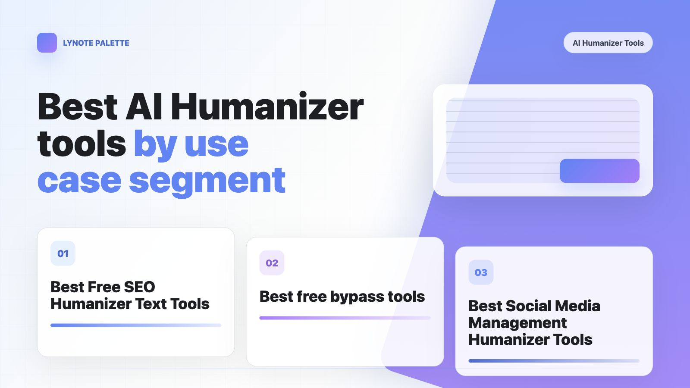

## **Chapter 4 \| Best ****AI Humanize****r**** ****tools by use case segment**

### 4\.1 Best Free SEO Humanizer Text Tools

It is also good for SEO if humanizing the text makes it more specific, credible and clearer while preserving all relevant keywords and facts\.

SEO Humanize does not entail "faking" AI text to appear as though it was authored by humans\. It takes  more easily readable, emotionless writing and converts it into content that is interesting for the user as well as convenient to digest for search engines\. Does it pass all four tests: retaining keywords and entities, having added realistic and believable information, improves readability and original sentence structure?

**Checklist:**Remove templated jargonDo introduce real life examples, testimonialsDisconnect KeywordsLeave your facts and referencesIntegrate your brand tone moreClarify paragraphs and cut the clutter

**Don'ts:** Be too out of focus with accuracy just to get through a detector, copy paste keywords in bulk, prepare fake experiences just to fill up the text and ruin quality content only for getting a tool that gets bypassed by whatever platform or the school uses\.

From an SEO point of view: Google has said on many occasions that no matter what way you use to produce content, the best quality content will be shown in the highest position on the searches\.The real concern is the bad quality content that has been created in bulk using automation\.

##### **Choose by Job, Not by Ranking**

|**Your job**|**Start with**|**Why**|
|---|---|---|
|Short English blog or product\-page snippets|Lynote, Ahrefs, Surfer|They sit closest to SEO workflows and are good for local copy cleanup\.|
|Brand voice and professional polish|Grammarly |Useful when the final copy must sound consistent and publishable\.|
|Controllable sentence\-level rewriting|QuillBot|Best when a human editor wants to review changes as they go\.|
|Pre\-publication quality checks|Originality\.ai |SEO/Blogs tone, rewrite depth, fact/readability/checker tools make it useful for QA\.|
|Multilingual short content|Lynote, Humanize\.io, AIHumanizer\.ai|Language coverage is broad, but localization and keyword retention still need review\.|
|Very low\-budget trials|BypassAI\.io|Friendly free entry, but limits and claims need verification\.|
|Bulk/API/paid upgrade path|HIX Bypass, Undetectable AI, Originality\.ai|Free access is not the main value; evaluate them as procurement candidates\.|

##### **A Practical SEO Humanizer Workflow**

This workflow is more reliable than pasting an entire article into a humanizer\. Treat the tool as an editing assistant, not the final author\.

1. Define search intent first: informational, commercial investigation, transactional, or navigational\. Put that intent at the top of your working document\.

2. List protected elements: primary keyword, secondary keywords, brand names, product names, prices, data points, citations, internal links, and CTA\.

3. Process in blocks: rewrite by H2/H3 section or 150\-300 word chunks to avoid logic drift\.

4. Add human evidence: real observations, comparison judgments, screenshots, failure cases, reader objections, and practical next steps\.

5. Run SEO QA: Does the intro answer the query? Are keywords natural? Are entities and related terms present?

6. Run credibility QA: verify facts, dates, prices, limits, citations, and external links\. Do not keep invented details\.

7. Do the final human read: remove generic lines, tighten empty phrases, vary sentence rhythm, and make every paragraph earn its space\.

|**Recommended stacks** Short English SEO copy: Lynote、Ahrefs or Surfer \-\> Grammarly \-\> manual SEO QA\.  Long\-form publishing: add Originality\.ai or Surfer for a second QA pass\.  Multilingual content: test Lynote, Humanize\.io, AIHumanizer\.ai, or Undetectable AI, then use a native or localization editor\.|
|---|

##### **Pre\-Publication Checklist**

|**Check**|**Question**|
|---|---|
|Search intent|Does the first 100 words answer the question that brought the reader to the page?|
|Keywords|Does the primary keyword appear naturally in title/H1/intro/at least one H2 without stuffing?|
|Entities|Did the tool preserve brands, products, people, places, tools, and technical terms?|
|Experience|Does the page include first\-hand observations, constraints, examples, or practical advice?|
|Readability|Did you remove stock phrases, split long sentences, and make paragraphs easy to scan?|
|Credibility|Did you verify prices, dates, feature limits, data, citations, and links?|
|Differentiation|Does the page add judgment, steps, or examples beyond generic SERP summaries?|
|Conversion|Is the CTA natural, useful, and aligned with the reader's next step?|

|**Reusable Rewrite Prompt** Rewrite the SEO draft below so it sounds more natural, specific, and editor\-written\. Keep the primary keyword, entities, prices, data points, citations, and internal links unchanged\. Do not add unverified facts\. Remove generic AI phrasing\. Vary sentence length\. Add clearer transitions or subheads where useful\. After the rewrite, include a change summary and a list of facts that still need human verification\.|
|---|

### 4\.2 Best free bypass tools

This chapter analyzes "bypass tools" from the perspective of natural writing, avoiding false alarms and the practical applicability of the products\. We in no way want to teach cheating or circumventing school rules\. Our goal is to help students write their thoughts, quotes and revisions clearly and clearly\. We do not want detection tools to become "absolute judges"\. Against this background, we have compiled the most current data and feedback from users \(as of June 2026\) to explain the most common advantages and disadvantages of common "avoidance tools"\.

##### **User Reviews List**

Since one product cannot meet the needs of all users, we also combined products by usage scenarios, so that users can accurately identify the product combination that suits their needs\.

##### **Recommended Stacks**

### 4\.3 Best Social Media Management  Humanizer Tools

**Humanizing in Social Media Management Is More Than Just "Making AI Copy Sound Natural"**

It also includes: consistent brand voice, platform\-specific tone adaptation, trending topic response, human touch in comments and DMs, content repurposing, visual consistency, and post\-publish data feedback\.

##### **Best Humanizer Social Media Tool Matrix**

##### **Recommended Tool Stack**

##### **A Practical Humanize Workflow for Social Media**

1. **Define your platforms first** — The pacing and expression style for WeChat Official Accounts, Xiaohongshu, Weibo, LinkedIn, X \(Twitter\), TikTok, and YouTube Shorts are completely different\. Do not post the same content across all platforms\.

2. **Lock in your brand voice** — Create a list of brand keywords, banned words, common sentence patterns, things you never say, how you address your audience, and your CTA style\.

3. **Humanize the copy first** — Use tools like Lynote / Grammarly / QuillBot to remove AI jargon, translationese, and templated phrases\.

4. **Rewrite per platform** — Take the same core topic and break it into: headlines, long\-form articles, short posts, captions, comment replies, DM replies, and short\-video scripts\.

5. **Align visual assets** — Use Canva or Predis to generate covers, supporting images, and short\-video storyboards\. Ensure copy and visuals match\.

6. **Schedule and publish** — Use Buffer, Hootsuite, or Sprout Social to manage timing, approvals, and cross\-platform versions\.

7. **Review and optimize** — Track clicks, saves, comments, shares, completion rates, conversions, and negative feedback\. Feed the data back into your headline and topic bank\.

8. **Pre\-publish QA** — Check facts, pricing, links, copyright, ad claims, platform\-specific sensitive words, AI\-generated content disclosure, and brand compliance\.
