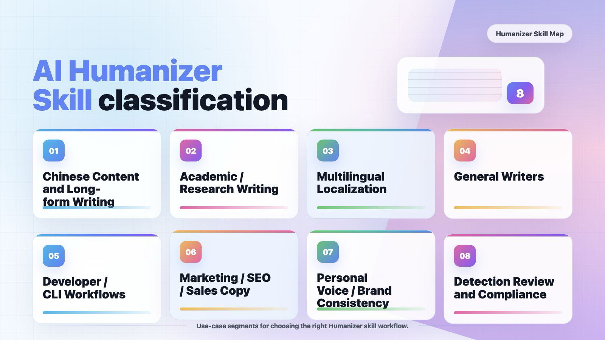

## **Chapter 5 \| What AI Humanizer skills Are Available?**

### 5\.1  Why we use AI Humanizer Skill

If the previous chapter compared the product to eating out at a restaurant, then this chapter teaches you how to build your own kitchen — both will fill you up, it just depends which one you prefer\. The Humanizer skill — essentially a list of text rules spanning hundreds or thousands of lines \(you can also think of it as a "plugin"\) — can be installed on your local computer and used together with AI chat software like Codex or Claude Code\. You copy and paste a piece of AI\-generated text, type a single command, and within seconds you get a more natural, human\-sounding version\. Unlimited use, no registration, no subscription \(at most it consumes a bit of your tokens\)\. The output is basically the same as what you'd get from paid websites\.

What we're talking about here is mainly the skill **totally free** found on GitHub, designed specifically to rewrite AI\-generated text so it sounds human\-written\.

All you need to do is** copy and paste **the instructions to use it\.

- Before using the Humanizer skill, be clear about its limitations:

    ❌ It cannot create a draft from scratch — you need to have a first draft to begin with\.

    ❌ It cannot guarantee 100% evasion of all AI detectors — it only lowers the probability\.

    ❌ It cannot write new content for you — it is a "rewriting tool," not a "writing tool\."

    ❌ It cannot guarantee accuracy after rewriting — it may occasionally alter facts, so you must read through the result\.

    ❌ Academic integrity is your own responsibility — using the tool to bypass school plagiarism checks means you bear the consequences; the tool does not vouch for you\.

- Since there's a free option, when should you consider paying?

    ✅ You use the skill to rewrite an article over and over, but it still fails AI detection\.

    ✅ You don't want to deal with any commands at all — you just want to open a webpage and click a button\.

    ✅ You need to rewrite dozens of articles in bulk and can't be bothered to paste each one manually\.

    ❌ None of the above applies? → Then don't spend any money\.

### 5\.2  AI Humanizer Skill classification

Based on the usage scenarios, we classify humanized tools as follows:

|**User Scenario**|**Count**|**Typical Users**|**Primary Priority**|**Repositories to Check First**|**Selection Note**|
|---|---|---|---|---|---|
|Chinese Content and Long\-form Writing|17|WeChat articles, blogs, reviews, product analysis, book chapters|Chinese prose quality, less translationese, factual preservation|op7418/Humanizer\-zh, MrGeDiao/shuorenhua, OUBIGFA/De\-AI\-Prompt\-Enhancer\-Writer\-Booster\-SKILL|Start with Chinese\-specific repositories\.|
|Academic / Research Writing|10|Papers, MBA theses, medical manuscripts, research drafts|Terminology protection, factual fidelity, reviewer\-appropriate style|redbaronyyyyy\-eng/humanizer\-zh\-academic, matsuikentaro1/humanizer\_academic, crabin/paper\-humanizer\-skill|Do not optimize primarily for detector evasion\.|
|Multilingual Localization|19|Russian, German, Korean, Finnish, Malay, Swedish, Portuguese, Japanese, etc\.|Local idiom, grammar, and language\-specific AI tells|ilyautov/humanizer\-ru, smixs/humanizer\-ru, Vladimir\-Human/humanizer\-ru|Choose by language rather than using a generic tool\.|
|General Writers|1|Articles, emails, explainers, draft polishing|Less formulaic language and stronger rhythm|theclaymethod/unslop|Check rule transparency and output controllability\.|
|Developer / CLI Workflows|18|Code comments, commits, README files, batch CLI workflows|Local execution, scriptability, low dependency footprint|blader/humanizer, conorbronsdon/avoid\-ai\-writing, Hainrixz/humanizalo|Prefer CLI and multi\-agent support\.|
|Marketing / SEO / Sales Copy|2|Landing pages, sales pages, SEO, cold email|Brand voice, keyword preservation, claim verification|forint573/miAI\-Humanizer\-Skill\-Awesome, thoughtful\-reservation690/humanise\-text\-skill|Avoid inventing performance claims or data\.|
|Personal Voice / Brand Consistency|1|Personal blogs, founder notes, team style|Voice profiles, brand terms, tonal consistency|brandonwise/humanizer|Requires sample text for calibration\.|
|Detection Review and Compliance|1|Editorial review, risk checks, content QA|Explainable scoring, evidence quotes, risk notes|chukant20\-cyber/Chuksbooks\-Humaniser\-tool|Detector results should be advisory only\.|

More specifically we have prepared a list of recommended use cases:

#### **1、Chinese Content and Long\-form Writing**

|**Repository**|**Stars**|**Best Fit**|**Link**|
|---|---|---|---|
|op7418/Humanizer\-zh|9619|A Chinese\-localized version of Humanizer for Claude Code Skills, designed to remove AI\-generated traces from t|[op7418/Humanizer\-zh](https://github.com/op7418/Humanizer-zh)|
|MrGeDiao/shuorenhua|389|A chinese / simplified chinese skill or tool candidate for chinese content and long\-form writing, based on the|[MrGeDiao/shuorenhua](https://github.com/MrGeDiao/shuorenhua)|
|OUBIGFA/De\-AI\-Prompt\-Enhancer\-Writer\-Booster\-SKILL|383|A de\-AI\-writing prompt and writer enhancement skill\.|[OUBIGFA/De\-AI\-Prompt\-Enhancer\-Writer\-Booster\-SKILL](https://github.com/OUBIGFA/De-AI-Prompt-Enhancer-Writer-Booster-SKILL)|
|devswha/patina|155|Detects and rewrites AI writing patterns in Korean, English, Chinese, and Japanese\. Runs as a skill for Claude|[devswha/patina](https://github.com/devswha/patina)|
|LifelongLazyLearner/qu\-ai\-wei|81|A Simplified Chinese humanizer skill for removing AI writing traces\.|[LifelongLazyLearner/qu\-ai\-wei](https://github.com/LifelongLazyLearner/qu-ai-wei)|
|shyuan/writing\-humanizer|15|A Claude Code plugin for removing AI writing traces and making Traditional Chinese text more natural\.|[shyuan/writing\-humanizer](https://github.com/shyuan/writing-humanizer)|
|ai\-zixun/humanizer\-zh|13|A Chinese de\-AI\-writing skill compatible with Codex, Claude Code, and OpenClaw for blogs, reviews, product ana|[ai\-zixun/humanizer\-zh](https://github.com/ai-zixun/humanizer-zh)|
|yelban/humanizer\.TW|10|Claude Code skill that removes signs of AI\-generated writing from text|[yelban/humanizer\.TW](https://github.com/yelban/humanizer.TW)|

#### **2、Academic / Research Writing**

|**Repository**|**Stars**|**Best Fit**|**Link**|
|---|---|---|---|
|redbaronyyyyy\-eng/humanizer\-zh\-academic|175|A Claude Code Skill for reducing AIGC detection risk in Chinese academic writing\.|[redbaronyyyyy\-eng/humanizer\-zh\-academic](https://github.com/redbaronyyyyy-eng/humanizer-zh-academic)|
|matsuikentaro1/humanizer\_academic|98|A Claude Code skill that removes signs of AI\-generated writing from academic medical papers, making them sound|[matsuikentaro1/humanizer\_academic](https://github.com/matsuikentaro1/humanizer_academic)|
|crabin/paper\-humanizer\-skill|89|A Chinese\-English academic polishing and humanization skill that removes AI\-generated traces while preserving |[crabin/paper\-humanizer\-skill](https://github.com/crabin/paper-humanizer-skill)|
|cangtianhuang/humanizer\-academic\-zh|39|A lightweight Chinese academic humanizer for Claude Code Skills and system prompts; fast, token\-efficient, and|[cangtianhuang/humanizer\-academic\-zh](https://github.com/cangtianhuang/humanizer-academic-zh)|
|harshaneel/humanize|24|Best static AI text humanizer\. Two research\-grounded skills that work in any LLM \(Claude, ChatGPT, Gemini, Cod|[harshaneel/humanize](https://github.com/harshaneel/humanize)|
|stephenlzc/humanize\-mba\-text\-skill|24|A Chinese MBA thesis tool for detecting and removing AI writing patterns\.|[stephenlzc/humanize\-mba\-text\-skill](https://github.com/stephenlzc/humanize-mba-text-skill)|
|gabelul/slopbuster|16|AI text humanizer for prose, code \& academic writing\. 100\+ patterns, two\-pass audit, three\-tier scoring, voice|[gabelul/slopbuster](https://github.com/gabelul/slopbuster)|
|momo2young/humanize\-academic\-writing|14|A Cursor/Claude AI skill that transforms AI\-generated academic text into natural scholarly writing\.|[momo2young/humanize\-academic\-writing](https://github.com/momo2young/humanize-academic-writing)|

#### **3、Multilingual Localization**

|**Repository**|**Stars**|**Best Fit**|**Link**|
|---|---|---|---|
|ilyautov/humanizer\-ru|65|A Claude skill for Russian text that removes 52 neural\-network writing markers, including bureaucratic style, |[ilyautov/humanizer\-ru](https://github.com/ilyautov/humanizer-ru)|
|smixs/humanizer\-ru|63|A russian skill or tool candidate for multilingual localization, based on the repository name, topics, and ava|[smixs/humanizer\-ru](https://github.com/smixs/humanizer-ru)|
|Vladimir\-Human/humanizer\-ru|46|A Russian AI\-agent skill that removes 29 machine\-generation markers from text\.|[Vladimir\-Human/humanizer\-ru](https://github.com/Vladimir-Human/humanizer-ru)|
|apurvrdx1/tagore|42|Make AI\-generated prose sound human\. 29\-pattern catalog \+ 8\-rule operating system \+ 8\-dimension scoring rubric|[apurvrdx1/tagore](https://github.com/apurvrdx1/tagore)|
|marmbiz/humanizer\-de|33|A German Humanizer version that detects and removes AI writing patterns across 57 patterns in 10 categories; i|[marmbiz/humanizer\-de](https://github.com/marmbiz/humanizer-de)|
|abualif120/manusiawi|27|Claude skill that strips AI writing patterns from Malaysian BM text\. 32 BM patterns \+ Indonesian intrusion det|[abualif120/manusiawi](https://github.com/abualif120/manusiawi)|
|Hakku/finnish\-humanizer|17|27 patterns that make AI\-generated Finnish sound human|[Hakku/finnish\-humanizer](https://github.com/Hakku/finnish-humanizer)|
|SergeNS\-mne/humanizer\-ru|12|A russian skill or tool candidate for multilingual localization, based on the repository name, topics, and ava|[SergeNS\-mne/humanizer\-ru](https://github.com/SergeNS-mne/humanizer-ru)|

#### **4、General Writers**

|**Repository**|**Stars**|**Best Fit**|**Link**|
|---|---|---|---|
|theclaymethod/unslop|25|An agent skill to de\-AI your writing|[theclaymethod/unslop](https://github.com/theclaymethod/unslop)|

#### **5、Developer / CLI Workflows**

|**Repository**|**Stars**|**Best Fit**|**Link**|
|---|---|---|---|
|blader/humanizer|22918|Claude Code skill that removes signs of AI\-generated writing from text|[blader/humanizer](https://github.com/blader/humanizer)|
|conorbronsdon/avoid\-ai\-writing|1735|Skill that audits and rewrites content to remove AI writing patterns\. Use it with your favorite agents includi|[conorbronsdon/avoid\-ai\-writing](https://github.com/conorbronsdon/avoid-ai-writing)|
|Hainrixz/humanizalo|71|Claude Code skill that detects 40 AI writing patterns and rewrites text to sound human\. Self\-auditing loop\. Bi|[Hainrixz/humanizalo](https://github.com/Hainrixz/humanizalo)|
|Aboudjem/humanizer\-skill|70|AI writing pattern detector and rewriter\. 43 patterns, 5 voices, 0\-100 AI\-tell score\. Pure Markdown, zero depe|[Aboudjem/humanizer\-skill](https://github.com/Aboudjem/humanizer-skill)|
|jpeggdev/humanize\-writing|24|Claude Code skill that rewrites AI\-generated content to sound human|[jpeggdev/humanize\-writing](https://github.com/jpeggdev/humanize-writing)|
|diaiq/claude\-skill\-humanizer|4|Free Claude Code skill to humanize AI\-generated text\. Bypass GPTZero, Turnitin, and other AI detectors\. Powere|[diaiq/claude\-skill\-humanizer](https://github.com/diaiq/claude-skill-humanizer)|
|itsjwill/humanizer\-x|4|4\-pass AI text humanizer \+ voice agent humanization engine\. 30 severity\-ranked patterns, statistical fingerpri|[itsjwill/humanizer\-x](https://github.com/itsjwill/humanizer-x)|
|apoapostolov/humanizer|3|Humanizer is an AI writing skill that detects and rewrites common signs of AI\-generated prose\. It helps agents|[apoapostolov/humanizer](https://github.com/apoapostolov/humanizer)|

#### **6、Marketing / SEO / Sales Copy**

|**Repository**|**Stars**|**Best Fit**|**Link**|
|---|---|---|---|
|forint573/miAI\-Humanizer\-Skill\-Awesome|0|A Claude Agent Skill that humanizes AI\-written marketing and long\-form copy: landing pages, sales pages, e\-boo|[forint573/miAI\-Humanizer\-Skill\-Awesome](https://github.com/forint573/miAI-Humanizer-Skill-Awesome)|
|thoughtful\-reservation690/humanise\-text\-skill|0|Humanise AI text for Claude Code and remove AI\-like patterns with one command|[thoughtful\-reservation690/humanise\-text\-skill](https://github.com/thoughtful-reservation690/humanise-text-skill)|

#### **7、Personal Voice / Brand Consistency**

|**Repository**|**Stars**|**Best Fit**|**Link**|
|---|---|---|---|
|brandonwise/humanizer|88|OpenClaw skill that detects and removes signs of AI\-generated writing, making text sound natural and human\. |[brandonwise/humanizer](https://github.com/brandonwise/humanizer)|

#### **8、Detection Review and Compliance**

|**Repository**|**Stars**|**Best Fit**|**Link**|
|---|---|---|---|
|chukant20\-cyber/Chuksbooks\-Humaniser\-tool|3|ChatGPT, Claude, and any other AI skill for rewriting AI\-generated text into natural human writing and bypassi|[chukant20\-cyber/Chuksbooks\-Humaniser\-tool](https://github.com/chukant20-cyber/Chuksbooks-Humaniser-tool)|

### 5\.3  Best AI Humanizer Skill

#### 1、Humanizer（https://github\.com/blader/humanizer）

Humanizer is not trying to be another AI writing model\. Its real value is that it turns the vague idea of “this sounds AI\-generated” into a clear editing system\.

Most people can feel when a paragraph has AI flavor, but it is hard to say exactly why\. humanizer breaks that feeling down into specific patterns: generic openings, inflated claims, over\-polished wording, repetitive sentence structure, empty transitions, marketing\-style adjectives, aHnd conclusions that sound too neat\.

Then it gives Claude Code or OpenCode a practical rulebook for fixing those problems\. Instead of simply saying “make this sound human,” it tells the editor what to look for, what to avoid, and how to rewrite while keeping the original meaning\.

So the project is useful because it makes AI text editing more consistent\. It is not just a prompt that asks for better writing\. It is a reusable skill that defines what “AI\-sounding” means, turns that into concrete rewrite rules, and packages the whole process into a tool you can call directly inside your coding workflow\.

#### 2、humanize\-skill（https://github\.com/fendouai/humanize\-skill）

Humanize\-skill is an agent\-native editorial workflow for Codex, Claude Code, and OpenCode\-style agents\. It does not ship a rewriting CLI or a detector\-bypass trick\. The host model does the semantic edit; the skill supplies the quality contract, voice calibration rules, AI\-pattern diagnosis, specificity pass, and fact\-checking obligations\.Use it when a draft needs to become clearer, more specific, more faithful to the author, and safer to publish\.

The public promise is five\-part:

- Quality\-first humanization: make the draft clearer, more specific, and more credible instead of chasing detector scores\.

- Deep voice matching: use real samples to match the author's rhythm, stance, reasoning style, and expression habits\.

- Five\-layer AI\-pattern diagnosis: diagnose lexical, phrasal, syntactic, structural, and cognitive AI\-looking patterns\.

- Specificity and reasoning pass: turn empty generalities into text with numbers, context, reasons, limits, and visible trade\-offs\.

- Fact\-aware rewriting: support, weaken, flag, or remove factual claims, especially in product, research, health, and technical writing\.

#### 3、Humanizer\-zh（https://github\.com/op7418/Humanizer\-zh）

Humanizer\-zh is a tool for removing AI\-generated traces from text, helping you rewrite AI\-generated content to make it sound more natural and human\-written\.

This project is suitable for:

Editing and reviewing AI\-generated content

Improving the human touch in writing

Learning to recognize common patterns in AI writing

#### 4、stop\-slop（https://github\.com/hardikpandya/stop\-slop）

A skill for removing AI tells from prose\. AI writing has patterns\. Predictable phrases, structures, rhythms\. This skill teaches Claude \(or any LLM\) to catch and remove them\. 

#### 5、[humanize\-text](https://github.com/lynote-ai/humanize-text)\(https://github\.com/lynote\-ai/humanize\-text\)

Free open\-source AI text humanizer to convert AI\-generated content into undetectable, human\-like writing\. Bypass Turnitin, GPTZero, and all major AI detectors\. No sign\-up required\. Try our unlimited free online tool\.
