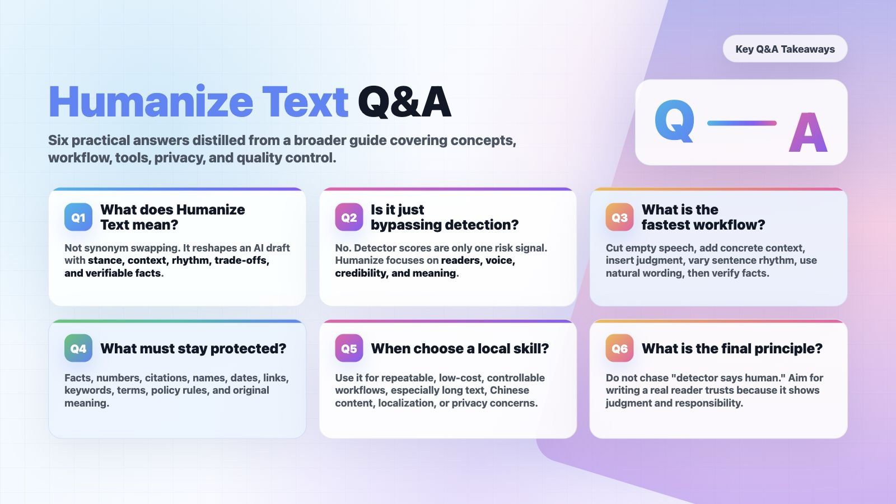

# Q\&A

## **A\. Basic Concepts**

**Q1: What does "Humanize Text" actually mean?**  

A: It's not simply swapping a few synonyms in an AI text, nor just making sentences "smoother\." It is transforming an AI draft into an expression that more closely resembles real human thinking: with a clear stance, specific context, natural rhythm, genuine trade‑offs, and verifiable facts\.

**Q2: Does Humanize Text equal bypassing AI detection?**  

A: No\. Bypassing focuses only on machine scores; Humanize focuses on the reader, the author's voice, and content credibility\. Detectors are just one external risk and should not be the sole goal of writing\.

**Q3: Why does AI text often feel mechanical?**  

A: Common reasons include overly polished viewpoints, too‑even sentence structures, hollow transition words, templated examples, lack of personal observation, conclusions without edge, and no real purpose for writing\.

**Q4: What is the most core criterion for Humanize?**  

A: After revision, the text should be more specific, more credible, show more authorial judgment, and be easier for the reader to absorb – while not damaging facts, citations, terminology, keywords, or original meaning\.

**Q5: What is the difference between Humanize and copyediting?**  

A: Copyediting usually focuses on grammar, fluency, and wording\. Humanize additionally focuses on traces of thinking, expressive rhythm, scenario details, personal voice, and the removal of AI‑template feel\.

**Q6: What is the difference between Humanize and paraphrasing?**  

A: Paraphrasing is more like "saying it in another way"; Humanize is "reconstructing the intent to express\." It goes beyond rewording – it deals with empty speech, rhythm, tone, examples, judgment, and credibility\.

**Q7: Does Humanize make text unprofessional?**  

A: No, provided you choose the appropriate register\. Academic text can be more natural yet still rigorous; business copy can be warmer without being exaggerated; student assignments can sound more like themselves without being sloppy\.

**Q8: Can Humanize write an article from scratch?**  

A: Not recommended to define it that way\. Humanize is rewriting and editing, not creating real‑life experience out of thin air\. You need to at least provide a draft, opinions, sources, or a scenario\.

**Q9: What kind of text most needs Humanize?**  

A: AI first drafts, SEO drafts, product descriptions, student reflections, emails, speeches, blog posts, paper abstracts, long‑form social media posts, translation‑ese, and any text that is "correct but soulless\."

**Q10: What text is not suitable for direct Humanize?**  

A: Legal documents, medical advice, financial advice, formal citations, contract terms, exam answers, sensitive personal materials, unpublished papers, or confidential business information\. For such content, first confirm the rules, privacy, and professional review\.

---

## **B\. Writing Workflow**

**Q11: How can I reduce the AI‑feel in 10 minutes?**  

A: Delete empty speech; add specific context; insert personal judgment; adjust sentence rhythm by mixing long and short sentences; replace overly formal words with more natural expressions; finally check that facts haven't been damaged\.

**Q12: How to Humanize a long article?**  

A: Don't run a one‑click change on the whole piece\. Process it in chunks by heading or 150–300 words\. First list the facts, keywords, citations, and terminology that must be preserved, then rewrite each section, and finally unify tone and structure\.

**Q13: What should be prepared before Humanizing?**  

A: Prepare the original text, target audience, writing scenario, tone requirements, must‑preserve keywords/terms/citations/data, and parts that cannot be changed\.

**Q14: What must be manually checked after Humanizing?**  

A: Facts, numbers, citations, proper nouns, prices, dates, conclusions, links, policy requirements, course rules, and whether any fabricated content has been added\.

**Q15: How to tell if a paragraph still has an AI feel?**  

A: Look for being too even, too correct, lacking trade‑offs, lacking a concrete target, lacking a real scenario, or lacking a "must‑say" reason\.

**Q16: How to make text sound more human without becoming sloppy?**  

A: Don't deliberately add typos or grammatical errors\. Better methods: add specific observations, real constraints, clear judgments, natural transitions, and layered sentence rhythms\.

**Q17: Can Humanize reduce readability?**  

A: Yes, if you only pursue "human‑likeness" while ignoring clarity\. Good Humanize should improve both naturalness and readability – not make the text wordy, casual, or chaotic\.

**Q18: Should I keep the AI‑generated draft?**  

A: Yes, it is recommended\. Especially in learning, work, and publishing scenarios, keeping the original draft, revision history, sources, and manual editing process is important evidence for addressing disputes and reviewing quality\.

---

## **C\. Tool \& Product Selection**

**Q19: Are free tools sufficient?**  

A: For short texts, local paragraphs, lightweight SEO, ordinary emails, and social media content, they are usually enough\. For long texts, batch processing, API, team collaboration, privacy control, and stable quality, paid tools or local skills are generally needed\.

**Q20: When is it worth paying?**  

A: When you need batch processing, long‑text quotas, multilingual stability, API, team permissions, file upload, detection\+rewriting closed loop, revision history, or better customer support – then consider paying\.

**Q21: What scenarios is Lynote suitable for?**  

A: Low‑cost trial, multilingual short texts, SEO drafts, student/writing center trials, file upload processing\. Its strengths are free entry, no registration, 600 words, 80\+ languages, and keyword preservation\.

**Q22: What scenarios is Phrasly suitable for?**  

A: Student long papers, writing platform workflows, detection\+humanize closed loop, Pages editor, and all‑in‑one multi‑tool usage\.

**Q23: What scenarios is Undetectable AI suitable for?**  

A: As a benchmark tool for the detection\+rewriting closed loop, especially for comparing outputs from other humanizers\. But be aware of subscription, payment, and cancellation disputes\.

**Q24: What scenarios is WriteHuman suitable for?**  

A: Multilingual use, teams, API/MCP, multiple output variants, and those who want to integrate a humanizer into automated workflows\.

**Q25: Are Grammarly and QuillBot considered humanizers?**  

A: They are mild humanizers\. They emphasize clarity, grammar, readability, and responsible writing – not "hard bypassing detection\."

**Q26: Why are Ahrefs and Surfer suitable for SEO Humanize?**  

A: They sit within the SEO toolchain, suitable for blog paragraphs, product pages, headings and descriptions, website copy, and pre‑publishing optimization\. But SEO success still depends on content quality and search intent matching\.

**Q27: How to judge whether a humanize product is reliable?**  

A: Look at whether the free quota is clear, pricing and cancellation are transparent, original meaning is preserved, keyword/term protection is supported, privacy statements exist, independent user reviews are available, and whether it exaggerates "100% pass rates\."

**Q28: Why can't I trust only the official success rate?**  

A: Official success rates are product marketing, not independent tests\. Detectors, text types, languages, length, and rewriting approaches all affect results\.

**Q29: Why should I read negative reviews?**  

A: Negative reviews better expose purchase risks, such as refund difficulties, accidental annual charges, opaque quotas, distorted output, slow customer service, and vague privacy policies\.

---

## **D\. SEO \& Content Publishing**

**Q30: Will Google penalize AI content?**  

A: Google's official stance is that it focuses on content quality, not whether content is AI‑generated\. Using AI or automation to create helpful, original, people‑first content is not against guidelines\. The risk is using automation to mass‑produce low‑value content intended to manipulate rankings\.

**Q31: What is the goal of SEO Humanize?**  

A: Match search intent, preserve keywords and entities, add real experience and credible details, improve readability – not simply "wash" AI text to look human‑written\.

**Q32: What are the most common mistakes when Humanizing SEO text?**  

A: Keywords being removed, facts changed, brand names altered, search intent weakened, fake experiences added, paragraphs becoming wordy, and sacrificing information density for naturalness\.

**Q33: What must be locked before SEO Humanize?**  

A: Primary keywords, secondary keywords, entities, heading hierarchy, internal links, external citations, CTAs, product names, prices, feature limitations, and publication dates\.

**Q34: Should AI‑generated content be disclosed?**  

A: Google suggests disclosing AI or automation use in scenarios where readers would reasonably expect to know how the content was produced\. Academic, news, health, finance, and review content should be especially cautious about disclosure\.

**Q35: Can Humanize improve SEO rankings?**  

A: It doesn't guarantee rankings\. It only helps content become more valuable to readers, less templated, and clearer\. Rankings also depend on topic authority, search intent, links, user experience, structure, and competitive landscape\.

**Q36: What is scaled content abuse?**  

A: Mass‑producing low‑originality, low‑value pages whose main purpose is not to help users but to manipulate search rankings\. Google explicitly includes this in its spam policies\.

---

## **E\. Academic \& Educational Scenarios**

**Q37: Can students use Humanize tools?**  

A: It depends on school, course, and assignment rules\. Legitimate uses include polishing language, reducing false positives, organizing expression, and preserving one's own thinking\. Illegitimate uses include ghostwriting, hiding AI generation, faking reading, or faking research\.

**Q38: Does Humanize violate academic integrity?**  

A: The tool itself does not determine violation; it depends on how it is used and the course rules\. If the tool replaces the student's thinking, reading, analysis, and writing responsibility, then there is academic integrity risk\.

**Q39: Why should international students pay more attention to Humanize?**  

A: Research shows AI detectors may be more likely to misclassify non‑native English writers\. Humanize can help make text more natural, but it cannot replace citations, drafts, and process evidence\.

**Q40: Can a teacher penalize a student solely based on an AI detector?**  

A: Not recommended\. Research and educational practice both show that AI detection has false positives, bias, and evasion issues\. A safer approach is to combine drafts, version history, oral explanations, sources, and class policies\.

**Q41: What if my work is falsely flagged as AI‑generated?**  

A: Keep drafts, version records, sources, screenshots of your writing process, class notes, literature excerpts, and revision records\. Ask the instructor to provide evidence and explain your writing path using process materials\.

**Q42: How should a teacher handle suspected AI text?**  

A: Don't just look at the detection percentage\. Conduct student interviews, ask for explanations of viewpoint sources, review the drafting process, check citations, compare with class performance, and provide a clear appeal path\.

**Q43: How should writing centers teach Humanize?**  

A: Approach it as "revision training": delete empty speech, add evidence, protect citations, explain revision reasons, preserve student voice – not teach students to chase detector scores\.

**Q44: What is the most important principle of Humanize in academic writing?**  

A: Factual fidelity, consistent terminology, complete citations, clear reasoning, natural register, and explainable revisions\. Do not change research conclusions for naturalness\.

---

## **F\. AI Detectors \& False Positives**

**Q45: Are AI detectors reliable?**  

A: Do not treat them as final arbiters\. Many studies show detectors have accuracy limits, false positives, language bias, and can be bypassed by rewriting\.

**Q46: Why do different detectors give very different scores?**  

A: Different training data, features, thresholds, text length, language support, and update frequencies\. It is normal for the same text to get different scores across tools\.

**Q47: Is short text more prone to false positives?**  

A: Usually yes\. Short texts have less information and less stable stylistic features, making detection harder\. Titles, abstracts, short emails, and short answers are not strong evidence\.

**Q48: Can grammar checking or copyediting trigger AI detection?**  

A: Possibly\. Light copyediting, human rewriting, translation, or grammar tools can change textual characteristics and cause detection fluctuations\.

**Q49: Can a humanizer guarantee 100% passing detection?**  

A: No\. Be wary of any guarantee of 100%\. Detectors update, and results vary across different texts, languages, and tools\.

**Q50: If multiple detectors show AI, does that definitely mean it is AI?**  

A: Still not a final conclusion\. It only indicates a stronger risk signal, which should be combined with process evidence, writing history, drafts, interviews, and citation verification\.

**Q51: Why can humanizers sometimes make text more suspicious?**  

A: If rewriting is excessive, rhythm is forced, word choice unnatural, facts drift, or tone inconsistent, the text may look like "disguised text\."

**Q52: Will detectors and humanizers keep fighting each other?**  

A: Yes\. Research already treats humanizers as one source of adversarial examples for detectors, meaning no single tool will guarantee long‑term results\.

---

## **G\. Privacy, Copyright \& Security**

**Q53: Can I upload a thesis or client document to an online humanizer?**  

A: Be cautious\. Check the privacy policy, data retention, whether data is used for training, deletion mechanisms, third‑party sharing, and whether enterprise agreements are supported\.

**Q54: What content should not be uploaded to online tools?**  

A: Unpublished papers, client contracts, student personal information, medical records, financial data, company secrets, exam question banks, internal reports, or any text containing personally identifiable or sensitive identity information\.

**Q55: Why is a local skill safer?**  

A: Local skills reduce the risk of uploading text to unfamiliar websites and are not subject to subscription or quota limits\. However, they still consume model tokens and cannot guarantee fact‑free errors\.

**Q56: Can Humanize cause copyright problems?**  

A: Possibly\. If the input text itself infringes copyright, rewriting does not necessarily solve the problem\. For copyrighted content, use fair use, summaries, or obtain permission\.

**Q57: If a tool says "we don't save or train on your data," is it safe?**  

A: That is a product claim\. Check the privacy policy, terms of service, enterprise agreements, data processing location, deletion mechanisms, and audit capabilities\.

---

## **H\. Humanize Skill \& Local Workflow**

**Q58: What is a Humanize skill?**  

A: A set of writing rules, prompts, and workflows for AI assistants that allows tools like Codex, Claude Code, etc\., to review and rewrite your text according to a consistent style\.

**Q59: What is the difference between a skill and a web product?**  

A: Web products are good for instant use; skills are better for local, controllable, repeatable, low‑cost, customizable workflows\.

**Q60: When should I prioritize a skill?**  

A: When you frequently handle long texts, Chinese content, localized content, academic texts, brand voice, batch documents, or when you don't want to upload content to a website\.

**Q61: When should I prioritize a web product?**  

A: When you don't want to configure tools, need a quick trial, need a detection\+rewriting closed loop, need team quotas, need customer support, or need an API\.

**Q62: Can a skill replace human editing?**  

A: No\. It can do initial screening and provide rewriting suggestions, but a human must still verify facts, tone, citations, structure, and compliance\.

**Q63: How to choose a Humanize skill on GitHub?**  

A: Choose by language and scenario\. For long Chinese texts, pick a Chinese‑specific skill\. For academic writing, pick one with strong term protection\. For SEO copy, pick one with strong keyword protection\. For developers, pick a CLI‑friendly one\.

**Q64: Is a higher star count better?**  

A: Not necessarily\. Stars only indicate attention\. Also check recent updates, README, rule transparency, applicable languages, examples, license, and actual output\.

---

## **I\. Prompts \& Quality Control**

**Q65: What should a good Humanize prompt include?**  

A: Role, goal, items to preserve, prohibited items, tone, output structure, and a human review checklist\. Explicitly state "do not fabricate facts" and "preserve the author's voice\."

**Q66: Why output a Change Summary?**  

A: It lets users know what was changed and helps teachers, editors, or oneself review\. Rewrites without a change summary are harder to track for risks\.

**Q67: Why output a Verification Checklist?**  

A: Because humanizers may incorrectly change facts, numbers, citations, prices, links, or terminology\. A checklist makes risks explicit\.

**Q68: How to preserve personal voice?**  

A: Provide 2–3 samples of your own previous writing and specify the target tone, e\.g\., "like a student reflection," "like a researcher explaining," or "like a PM writing a doc\."

**Q69: How to avoid making the text too marketing‑like?**  

A: Explicitly state in the prompt: "no exaggeration, no sales pitch, no fabricated claims, no fake data\." This is especially important for academic and educational scenarios\.

**Q70: How to avoid making the text too formal?**  

A: Ask for natural, clear, moderately colloquial expression while preserving the author's identity\. Student texts should not be turned into paper‑ese; blogs should not become report‑ese\.

**Q71: How to protect keywords?**  

A: First list primary keywords, secondary keywords, entities, and anchor text for links, then require "preserve as‑is or appear naturally – do not delete, distort, or over‑stuff\."

---

## **J\. Common Troubleshooting**

**Q72: What if facts change after rewriting?**  

A: Revert to the previous version, lock facts and numbers, and require the tool to only adjust tone and structure – not rewrite factual sentences\.

**Q73: What if the detection score is still high after rewriting?**  

A: Don't rewrite endlessly\. First check whether the text is too short, too templated, lacks personal experience, or has unnatural citations\. Then decide whether to manually add authentic content\.

**Q74: What if the rewritten text sounds "deliberately trying to be human"?**  

A: Reduce random colloquialisms and forced emotional words\. Instead, add genuine judgments, concrete scenarios, and more natural transitions\.

**Q75: What if keywords are lost after rewriting?**  

A: Set keywords as locked items and require a "keyword preservation check" in the output\. For SEO text, it's best to list preservation status in a table\.

**Q76: What if citation formatting breaks after rewriting?**  

A: Protect references, quotations, and footnotes separately – do not let the tool rewrite the citation area\. After rewriting the body, manually verify citations\.

**Q77: How to handle multilingual text?**  

A: Prioritize language‑specific tools or localization skills\. Do not take an English humanizer, run non‑English text through it, and then machine‑translate back\.

**Q78: Why does Chinese text often feel like translation‑ese?**  

A: AI often imposes English logic and connectors onto Chinese\. The fix is to delete templated chains like "First/Second/In conclusion" and replace them with a more natural Chinese rhythm\.

**Q79: Why does the text get longer after rewriting?**  

A: The tool may add explanations for naturalness\. Add to the prompt: "keep length within 110% of the original" or "prioritize cutting empty speech\."

**Q80: Why does the text get shorter after rewriting?**  

A: The tool may have removed details\. Add to the prompt: "preserve all facts, examples, constraints, and keywords – do not just summarize\."

**Q81: If the product output is bad, is the tool no good?**  

A: Not necessarily\. The input may be too short, requirements unclear, audience not specified, keywords unprotected, or style samples missing\. First improve the prompt, then switch tools\.

**Q82: What should I check most before subscribing/paying?**  

A: Monthly/annual terms, cancellation process, refund policy, quota refresh rules, auto‑renewal, trial traps, customer support responsiveness, and real negative reviews\.

---

## **K\. Quick Decisions**

**Q83: I just want to modify a short paragraph – what should I use?**  

A: A free web tool or a general Humanize skill is enough\. The key is to read it yourself afterward\.

**Q84: I want to Humanize a long Chinese text – what should I use?**  

A: Prioritize a Chinese‑specific skill or a multilingual tool with good Chinese support\. Always process long texts in sections\.

**Q85: I want to Humanize SEO copy – what should I use?**  

A: Consider Lynote, Ahrefs, Surfer, Humanize\.io, AIHumanizer\.ai\. Before publishing, do a manual SEO QA check for search intent, keywords, facts, and E‑E‑A‑T\.

**Q86: I want to Humanize academic text – what should I use?**  

A: Choose an academic‑writing‑specific skill or a tool that emphasizes term protection\. Do not aim solely at bypassing detection\. Preserve drafts, citations, and revision records\.

**Q87: I need batch processing for a team – what should I use?**  

A: Prioritize API, permissions, data retention, batch quotas, logs, customer support, enterprise agreements, and cancellation terms\. WriteHuman, HIX, Undetectable, Phrasly are candidates\.

**Q88: I have a very low budget – what should I use?**  

A: Start with free tools, Lynote, GPTinf's low‑cost option, or a local skill\. Do not buy an annual subscription upfront\.

**Q89: What is the final one‑sentence principle?**  

A: The end goal of Humanize is not "detector says human," but that **another human is willing to read it carefully and believe that this text truly comes from someone with judgment and responsibility\.**
